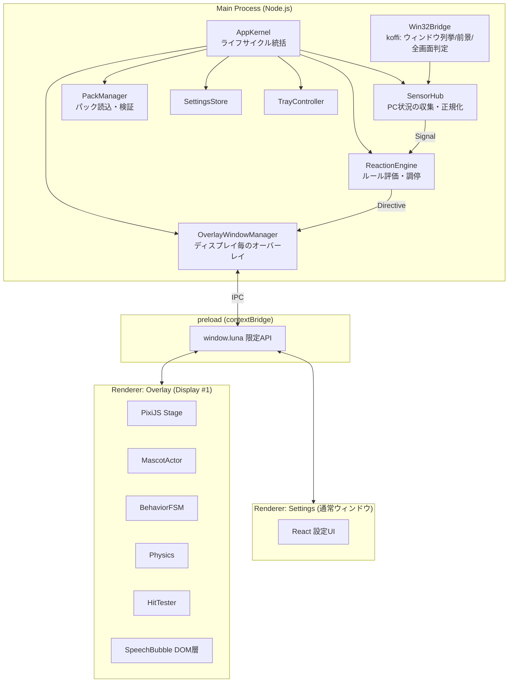
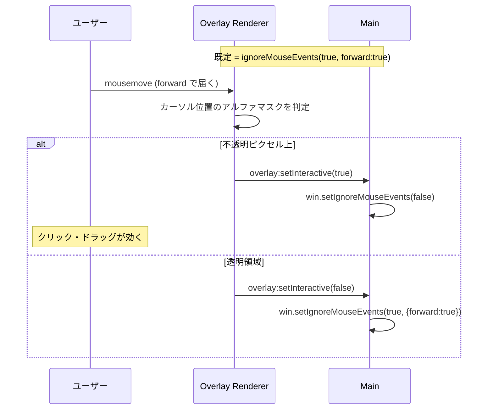
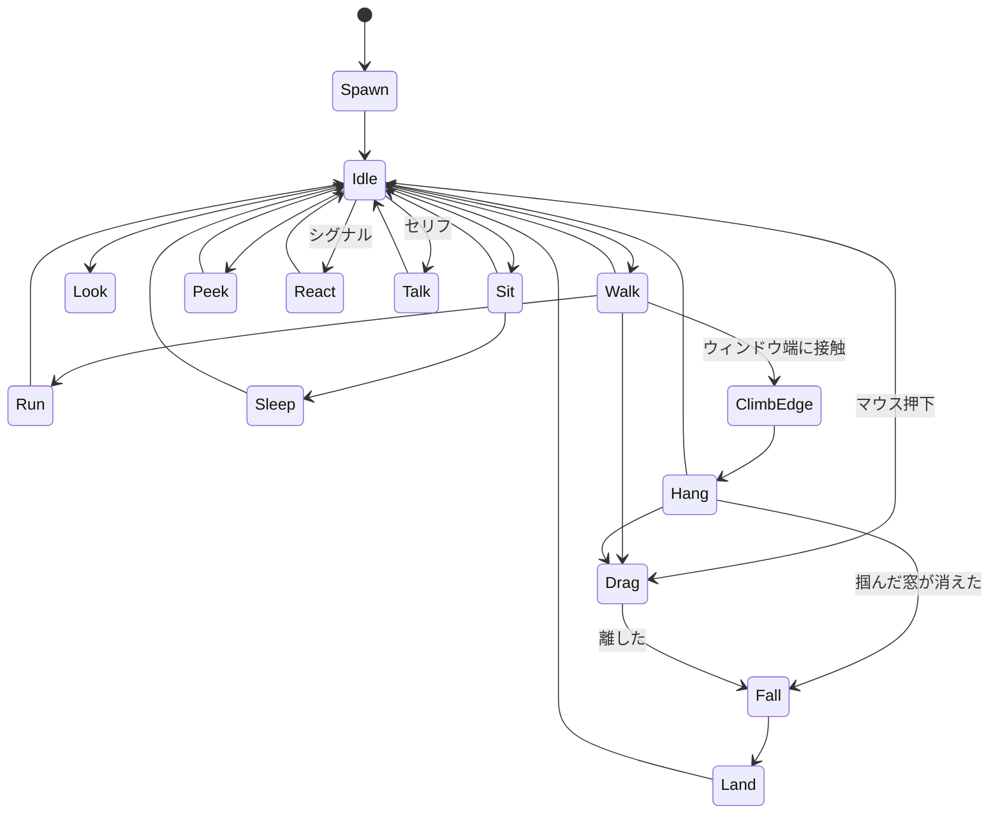
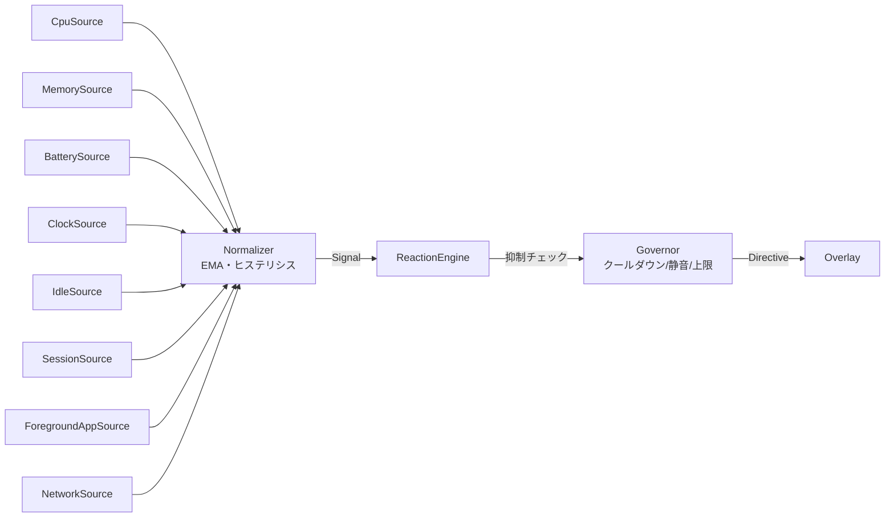

# LUNA — デスクトップマスコット 設計書

> 対象OS: **Windows 10 / 11 (x64)**
> 表現方式: **2D スプライト**
> ランタイム: **Electron + TypeScript + PixiJS**
> スコープ: **マスコット挙動 ＋ PC 状況連動リアクション**
> ドキュメント版数: v1.0 (初版)

---

## 1. コンセプト

デスクトップの片隅に住みつく、手のひらサイズ（既定 128 dip 相当）のチビキャラ「**ルナ**」。

三つの原則で全ての設計判断を行う。

| # | 原則 | 意味するところ |
|---|------|----------------|
| P1 | **邪魔をしない** | 絶対にフォーカスを奪わない。クリックを吸わない。全画面アプリの上に出ない。喋りすぎない。 |
| P2 | **生きている** | ランダムではなく「文脈」で動く。CPU が唸っていれば汗をかき、深夜には眠そうにする。 |
| P3 | **拡張できる** | キャラは JSON + PNG の「パック」。コードを書かずに差し替え・追加ができる。 |

P1 は特に重要で、デスクトップマスコットが嫌われる原因のほぼ全てが「作業の邪魔」に集約される。
本設計では**クリックスルー**・**フォーカス非奪取**・**クールダウン**・**静音モード**を仕様の中核に置く。

---

## 2. 技術選定と根拠

| 領域 | 採用 | 却下した案と理由 |
|------|------|------------------|
| シェル | **Electron 33+** | Tauri: Windows の WebView2 は per-pixel 透過とクリックスルー制御の実績が薄く、`setIgnoreMouseEvents` 相当の手当てが自前になる。Unity: チビ2Dには過剰でビルドが重い。PySide6: アニメーション表現とパッケージングが弱い。 |
| 描画 | **PixiJS v8 (WebGL)** | Canvas2D でも足りるが、色調変化・アウトライン・パーティクル（Zzz、汗、ハート）をフィルタで安く実現でき、複数体表示時のドローコールもまとまる。 |
| 言語 | **TypeScript 5 (strict)** | 状態機械とパックスキーマが型で守れる。 |
| ビルド | **electron-vite** | main / preload / renderer の3ターゲットを1設定で HMR 込み。 |
| 配布 | **electron-builder (NSIS + portable)** | インストーラ版とZIP解凍即実行版の両方を出す。 |
| Win32 呼出 | **koffi** | node-ffi-napi は Node ABI 更新のたびに壊れる。koffi はプリビルド不要かつメンテが活発。 |
| システム情報 | **systeminformation** | CPU/メモリ/バッテリを1ライブラリで賄える。 |
| 設定永続化 | **electron-store** | `%APPDATA%\LUNA\config.json`。スキーマ検証付き。 |
| 検証 | **zod** | パック JSON とIPCペイロードのランタイム検証。 |
| テスト | **Vitest + Playwright(Electron)** | ロジックは単体、ウィンドウ挙動は E2E。 |

### 2.1 Electron を選ぶ上で受け入れるコスト

- 常駐メモリが Tauri より大きい（実測目標は §11 の予算表で縛る）。
- 透過ウィンドウ + ハードウェアアクセラレーションは Windows の一部 GPU ドライバでちらつく事例がある。
  → §5.5 の緩和策（`backgroundThrottling: false`、`paintWhenInitiallyHidden`、GPU ブラックリスト時の Canvas2D フォールバック）で対処する。

---

## 3. 全体アーキテクチャ



### 3.1 プロセスとウィンドウの構成

| 種別 | 個数 | 役割 |
|------|------|------|
| Main | 1 | 状態の真実源。センサー、ルール評価、Win32、設定。 |
| Overlay Window | **ディスプレイ数と同数** | 各ディスプレイ全体を覆う透過・クリックスルー窓。マスコットの描画と物理を担当。 |
| Settings Window | 0 or 1 | 通常の不透明ウィンドウ。必要時のみ生成。 |
| Tray | 1 | 常駐の入口。 |

**「小さい窓を毎フレーム動かす」方式は採らない。**
Windows では `setBounds` を 60Hz で呼ぶと DWM 合成と競合して残像・カクつきが出る上、ドラッグ追従が目に見えて遅れる。
代わりに**ディスプレイ全面の透過窓を1枚張り、その中の canvas 座標でキャラを動かす**。
窓自体は動かないため移動は完全に 60fps で滑らかになり、複数体表示・キャラ同士の相互作用も自然に書ける。

代償はクリックスルーの厳密さで、これは §5.3 の per-pixel ヒットテストで解決する。

---

## 4. 座標系

3つの座標系を明確に分離する。混同はマルチモニタ + 混在DPI環境で必ずバグになる。

| 名前 | 定義 | 使う場所 |
|------|------|----------|
| **Virtual (dip)** | 仮想デスクトップ全体の DIP 座標。Electron の `screen` API と同じ。負値もあり得る。 | アクターの正準位置、ディスプレイ間の受け渡し |
| **Local (dip)** | あるオーバーレイ窓の左上を原点とした DIP 座標。`local = virtual - display.bounds.origin` | Pixi のステージ座標 |
| **Physical (px)** | Local × `devicePixelRatio` | スプライトの実解像度選択、ヒットマスク |

- アクターの `position` は常に **Virtual (dip)**。
- ディスプレイごとに `scaleFactor` が異なる混在DPI環境では、窓の `devicePixelRatio` が異なるため、
  アトラスは **@1x / @1.5x / @2x** を用意し、`Math.ceil(dpr)` に最も近い倍率を選ぶ（§ CHARACTER_PACK 参照）。
- Win32 から得られる他アプリのウィンドウ矩形は **Physical** なので、`screen.screenToDipPoint()` で必ず Virtual に変換してから使う。

### 4.1 ディスプレイ間の引き継ぎ（Actor Handoff）

キャラがモニタ境界を跨ぐときは、**アクターの所有権をオーバーレイ間で移譲**する。

```
Overlay#1 (owner)          Main                    Overlay#2
   |  position.x が                                    |
   |  display1.bounds を                               |
   |  超えた                                           |
   |---- actor:handoff ------->|                       |
   |     {actorId, snapshot}   |---- actor:adopt ----->|
   |                           |                       | 以降 #2 が
   |<--- actor:release --------|                       | シミュレート
```

`snapshot` はアクターの完全な再現に必要な最小状態（位置・速度・向き・現在状態・状態残時間・パックID・所持アニメ進行度）。
毎フレームの IPC は一切行わない。IPC が走るのは境界跨ぎの瞬間だけ。

---

## 5. オーバーレイウィンドウ設計

### 5.1 BrowserWindow オプション

```ts
new BrowserWindow({
  x: display.bounds.x, y: display.bounds.y,
  width: display.bounds.width, height: display.bounds.height,

  transparent: true,          // 背景を完全透過
  backgroundColor: '#00000000',
  frame: false,
  hasShadow: false,
  resizable: false,
  movable: false,
  minimizable: false,
  maximizable: false,
  fullscreenable: false,

  skipTaskbar: true,          // タスクバーに出さない
  focusable: false,           // ★ P1: 絶対にフォーカスを奪わない
  acceptFirstMouse: true,
  show: false,                // 初期化完了後に showInactive()

  webPreferences: {
    preload,
    contextIsolation: true,
    nodeIntegration: false,
    sandbox: true,
    backgroundThrottling: false, // ★ 非フォーカス時もアニメを止めない
  },
})
```

生成後:

```ts
win.setAlwaysOnTop(true, 'screen-saver')  // 通常ウィンドウより確実に上
win.setVisibleOnAllWorkspaces(true)
win.setIgnoreMouseEvents(true, { forward: true })  // 既定はクリックスルー
win.showInactive()                          // ★ show() は使わない（フォーカスを奪う）
```

`focusable: false` と `showInactive()` の二重掛けが P1 の要。
`show()` や `focus()` は本アプリのオーバーレイに対して**呼ばないことをレビュー観点とする**（lint ルール化を検討）。

### 5.2 常時最前面のレベル選択

`'screen-saver'` レベルは全画面ゲームの上にも出てしまうため、これ単体では P1 に反する。
**「最前面に出す」ことと「全画面を検出して自ら退く」ことをセット**にする（§7.4）。

### 5.3 per-pixel クリックスルー（ヒットテスト）

最も繊細な部分。次の流れで実現する。



実装上の要点:

1. **WebGL の `readPixels` を毎フレーム呼ばない。** 遅い上に GPU 同期が入る。
   代わりに**パック読込時に各フレームのアルファマスクを 1/2 解像度の `Uint8Array` ビットセットへ事前展開**しておく。
   判定は `mask[(y>>1) * strideBits + (x>>1)]` のビット参照のみで、実質ゼロコスト。
2. **ヒステリシス**を入れる。侵入判定は素のマスク、離脱判定はマスクを 3px 膨張させたもので行う。
   輪郭上でカーソルが震えると `setIgnoreMouseEvents` が高速に往復し、クリックが取りこぼされるため。
3. **判定対象はキャラ本体 + 吹き出し矩形 + コンテキストメニュー**。吹き出しは DOM なので矩形判定で足りる。
4. ドラッグ中は判定を止め、強制的に `interactive = true` を維持する（ポインタキャプチャ）。
5. IPC は**状態が変化したときだけ**送る（前回値と比較）。mousemove ごとに送らない。

### 5.4 表示レイヤ構成

オーバーレイ窓の中身は2層。

| z | 層 | 技術 | 理由 |
|---|----|------|------|
| 2 | 吹き出し・コンテキストメニュー | **DOM** | テキストのサブピクセル描画とフォント指定が素直。折返し・選択・リンクも DOM が強い。 |
| 1 | キャラクター・エフェクト | **PixiJS canvas** | フィルタ・大量スプライト。 |
| 0 | 背景 | 透過 | 何も描かない。 |

DOM 層は `pointer-events: none` を既定とし、吹き出し要素のみ `auto` にする。

### 5.5 ちらつき・GPU 対策

- `app.disableHardwareAcceleration()` は**しない**（アニメが CPU を食う）。代わりに:
  - 起動時に `app.getGPUFeatureStatus()` を確認し、`gpu_compositing` が無効なら Pixi を `preference: 'canvas'` で初期化するフォールバックを持つ。
  - 既知の問題環境向けに設定で「互換描画モード」を手動 ON にできるようにする。
- ウィンドウ生成直後に一度だけ全面クリアを描く（初期フレームの黒塗り対策）。
- ディスプレイ構成変更 (`screen` の `display-added` / `display-removed` / `display-metrics-changed`) では
  **窓を作り直す**。既存窓の `setBounds` で追従すると DPI 変更時に canvas が壊れる。

---

## 6. 描画とアニメーション

### 6.1 アセット形式

スプライトシート PNG + TexturePacker 互換 JSON (Hash 形式)。
詳細は [`CHARACTER_PACK.md`](./CHARACTER_PACK.md)。

### 6.2 アニメーション再生

- `AnimationPlayer` が「フレーム配列 + fps + loop」を再生する。可変フレーム尺（フレームごとの `durationMs`）にも対応。
- **描画は固定 30fps を既定、設定で 60fps。** チビキャラのコマ数は 6〜12fps 程度で作られるため、
  30fps でも見た目は変わらず、消費電力が半分になる。移動の滑らかさが要る `walk` / `drag` / `fall` の間だけ 60fps に上げる**適応フレームレート**を採る。
- 補間はしない（ドット/セル調の見た目を守るため `NEAREST` スケーリング、`roundPixels: true`）。

### 6.3 常駐アプリとしてのループ設計

```ts
// 適応フレームレート: 動きのない状態では requestAnimationFrame を間引く
const target = actor.isMoving || hasActiveEffect ? 60 : 30
```

- 全アクターが `idle` かつ吹き出し無し、かつユーザー入力が 5 分ない → **10fps まで落とす**（省電力）。
- 画面ロック中 (`powerMonitor: 'lock-screen'`) → **描画完全停止**（`cancelAnimationFrame`）。
- バッテリー駆動かつ残量 20% 未満 → 上限 30fps に固定。

---

## 7. 振る舞い設計

### 7.1 状態機械



### 7.2 状態の優先度と割り込み

同時に成立し得る要求を**優先度**で調停する。高い方が低い方を中断できる。

| Pri | 分類 | 例 | 中断可否 |
|-----|------|----|----------|
| 3 | システム緊急 | 全画面アプリ検出による退避、画面ロック、終了 | 全てを即中断 |
| 2 | ユーザー操作 | ドラッグ、クリック、コンテキストメニュー | Pri 0–1 を中断 |
| 1 | リアクション | CPU 高負荷、バッテリー低下、時報、復帰挨拶 | Pri 0 を中断 |
| 0 | 環境（アンビエント） | idle / walk / sit / sleep / peek | 中断される側 |

同 Pri 内では**後勝ちしない**。実行中のものが `interruptible: false`（例: 落下中、着地モーション中）なら、
新しい要求は最大 3 秒キューに保持し、それを過ぎたら破棄する。

### 7.3 アンビエント行動の選択

各状態は「次に遷移し得る状態と重み」を持つ（パックで定義）。滞在時間は `[minDurationSec, maxDurationSec]` の一様乱数。

重みは**文脈で補正**される:

| 文脈 | 補正 |
|------|------|
| 深夜 (23:00–05:00) | `sleep` ×4, `run` ×0.2 |
| ユーザー無操作 5 分以上 | `sleep` ×3, `walk` ×0.5 |
| 前景アプリがゲーム/会議 | 全ての移動系 ×0.1（静かにする） |
| 静音モード ON | `talk` を完全に禁止、移動系 ×0.3 |
| バッテリー 20% 未満 | 移動系 ×0.3 |

補正は**乗算した上で正規化**する。パック側は「素の性格」だけを書けばよく、環境適応はエンジンが行う。

### 7.4 全画面アプリからの退避（P1 の中核）

前景ウィンドウがあるディスプレイ全体を覆っている、または排他全画面のとき:

1. そのディスプレイのオーバーレイを 200ms でフェードアウトし、`win.hide()`。
2. 状態は保持（位置・状態を凍結）。
3. 全画面が解除されたら `showInactive()` + フェードイン、`peek`（覗き込み）から復帰する。

判定は `Win32Bridge` の `GetForegroundWindow` + `GetWindowRect` + `GetWindowLong(GWL_STYLE)` で行い、2 秒間隔でポーリングする。
**UAC の同意画面（セキュアデスクトップ）**は別デスクトップなのでそもそも描画されないが、復帰時に位置がずれないことをテスト項目に含める。

---

## 8. 物理

チビキャラの「重さ」を表現する最小限の物理。単位は dip / 秒。

| パラメータ | 既定値 | 備考 |
|-----------|--------|------|
| 重力 `g` | 1800 dip/s² | 体感で「軽くてよく跳ねる」値 |
| 終端速度 | 2400 dip/s | 高解像度モニタで抜けないための上限 |
| 反発係数 `e` | 0.35 | 着地でひと跳ねする |
| 地面摩擦 | 0.80 /s | 投げた後の滑り |
| 投げ速度 | ドラッグ直近 100ms の平均速度 × 1.2、上限 2000 dip/s | |

**接地面**は次の集合の和として毎秒再計算する:

1. 各ディスプレイの作業領域下端（タスクバー上端）
2. `Win32Bridge` が列挙した可視ウィンドウのタイトルバー上端（幅 ≥ 200dip のもののみ）
3. 設定で「ウィンドウに乗る」を OFF にした場合は 1 のみ

積分は**固定タイムステップ (1/120s) のセミインプリシット・オイラー**。描画フレームレートが変動しても挙動が変わらないようにする。

```
accumulator += dt
while (accumulator >= STEP) { integrate(STEP); accumulator -= STEP }
```

すり抜け防止のため、1 ステップの移動量が接地面の厚みを超える場合はスイープ判定（線分 × 水平線分の交差）を行う。

---

## 9. PC 状況連動

本アプリの差別化点。**センサー → シグナル → ルール → リアクション**の4段で組む。



### 9.1 センサー一覧

| ソース | 取得手段 | 周期 | 生成シグナル |
|--------|----------|------|-------------|
| CPU | `systeminformation.currentLoad()` | 3s | `cpu.high` (>80%), `cpu.sustainedHigh` (>80% が 30s 継続), `cpu.calm` |
| メモリ | `systeminformation.mem()` | 10s | `mem.high` (>85%) |
| バッテリ | `systeminformation.battery()` | 30s + 電源イベント | `battery.low` (<20%), `battery.critical` (<10%), `battery.charging`, `battery.full` |
| 時刻 | 分境界に整列したタイマー | 60s | `time.hourly`, `time.morning/noon/evening/lateNight`, `time.userDefined` |
| 無操作 | `powerMonitor.getSystemIdleTime()` | 15s | `user.away` (>300s), `user.back` |
| セッション | `powerMonitor` イベント | イベント | `session.lock`, `session.unlock`, `session.suspend`, `session.resume` |
| 前景アプリ | `Win32Bridge.getForegroundApp()` | 2s | `app.changed` (payload: exe名/カテゴリ), `app.fullscreen` |
| ネットワーク | `net.isOnline()` + イベント | イベント | `net.offline`, `net.online` |
| ディスプレイ | `screen` イベント | イベント | `display.changed` |

**前景アプリのカテゴリ分類**は同梱の分類表（exe名 → `editor` / `browser` / `terminal` / `game` / `meeting` / `media` / `office` / `other`）で行い、ユーザーが追加・上書きできる。
分類表はパックではなくアプリ本体の設定に置く（キャラを変えても分類は共通であるべきなので）。

### 9.2 正規化のルール

生値をそのまま流すとリアクションが暴れる。Normalizer が次を担う。

- **EMA 平滑化**: CPU は α=0.3 の指数移動平均。瞬間的なスパイクで反応しない。
- **シュミットトリガ**: `cpu.high` は 80% で ON、**65% まで下がって初めて OFF**。境界での振動を防ぐ。
- **持続条件**: `sustainedHigh` は「ON 状態が連続 30 秒」を満たしたときにのみ 1 度だけ発火。
- **立ち上がりのみ通知**: 状態系シグナルは `enter` / `exit` のエッジで発火し、継続中は発火しない。

### 9.3 リアクションの調停（Governor）

「反応して欲しい」と「うるさい」の境界を守るための抑制層。

| 抑制 | 既定値 |
|------|--------|
| ルール個別クールダウン | ルールごとに定義（例: CPU 高負荷は 15 分） |
| グローバル発話上限 | **6 回/時**、かつ最短間隔 90 秒 |
| 静音モード | 発話を全面禁止、モーションのみ許可 |
| 集中モード（自動） | 前景が `game` / `meeting` の間は Pri 1 以下を全て抑制 |
| 就寝時間帯 | 設定した時間帯は発話禁止（既定 OFF） |
| 起動直後 | 起動から 60 秒はリアクション抑制（起動時のスパイクで反応しないため） |

抑制されたリアクションは**キューに積まず捨てる**。溜めて後で一気に喋るのは最悪の体験なので。

### 9.4 リアクション例（既定パック）

| シグナル | 反応 |
|----------|------|
| `cpu.sustainedHigh` | 汗をかくアニメ + 「うわ、パソコンあつあつだよ…」 |
| `battery.low` | コンセントを指差す + 「そろそろ充電しよ？」 |
| `battery.charging` | 嬉しそうに跳ねる（発話なし） |
| `user.back`（30 分以上の離席後） | 手を振る + 「おかえり！」 |
| `session.unlock` | 伸びをする |
| `time.lateNight` (深夜1時) | あくび + 「そろそろ寝よ…？」 |
| `app.changed` → `game` | 隅に移動して静かに座る（発話なし） |
| `net.offline` | 首をかしげる |
| `time.hourly` | 時報（既定 OFF） |

「発話なし」の反応を多めに用意するのが体感品質の鍵。モーションだけの反応はうるさくならない。

---

## 10. UI

### 10.1 トレイメニュー

```
LUNA
├─ ルナを呼ぶ          (現在のディスプレイのカーソル付近に移動)
├─ 隠す / 表示         (トグル)
├─ 静音モード          (チェック)
├─ ─────────
├─ キャラクター ▸      (インストール済みパック一覧・ラジオ)
├─ ふやす / へらす     (体数 1–5)
├─ ─────────
├─ 設定…
├─ LUNA について
└─ 終了
```

トレイ左クリックで「呼ぶ」、右クリックでメニュー。

### 10.2 キャラ右クリックメニュー

`なでる` / `おしゃべり` / `ここに固定` / `しまう` / `設定…`

### 10.3 設定ウィンドウ

| タブ | 内容 |
|------|------|
| 基本 | 起動時に自動起動、体数、表示サイズ (75–200%)、対象ディスプレイ、フレームレート |
| ふるまい | 活発さ（3段階）、ウィンドウに乗る ON/OFF、投げられるか、画面外に出ない |
| おしゃべり | 静音モード、発話頻度、就寝時間帯、時報 |
| 連動 | センサー個別の ON/OFF としきい値、前景アプリ分類の編集 |
| キャラクター | パック一覧、フォルダを開く、再読込 |
| 詳細 | 互換描画モード、ログレベル、設定のエクスポート/インポート |

### 10.4 吹き出し

- キャラの頭上に出す。画面端では自動的に反対側へ反転。
- 表示時間 = `max(2.5s, 文字数 × 0.12s)`、上限 8 秒。クリックで即閉じ。
- 表示中に新しい発話が来たら**差し替えず、破棄**する（Governor の最短間隔で通常は起きない）。
- 文字送りアニメ（1 文字 25ms）。設定で OFF 可。

---

## 11. 性能予算

**守れなければ設計を見直す**という意味での予算。CI で計測はしないが、リリース前チェックリストに入れる。

| 指標 | 目標 | 上限 |
|------|------|------|
| アイドル時 CPU（1体・30fps） | < 1.0% | 2.0% |
| 移動時 CPU（1体・60fps） | < 2.5% | 4.0% |
| 常駐メモリ（Main + Overlay 1枚） | < 180 MB | 250 MB |
| 起動からキャラ表示まで | < 1.5 s | 3.0 s |
| GPU メモリ | < 60 MB | 120 MB |
| ヒットテスト 1 回 | < 0.05 ms | 0.2 ms |
| センサー1周期の Main 占有 | < 15 ms | 40 ms |

主要な削減手段:

- `backgroundThrottling: false` を入れる代わりに**自前で間引く**（§6.3）。
- センサーは全て Main の**単一スケジューラ**で回し、タイマーを乱立させない（タイマー起床は電力を食う）。
- Win32 のウィンドウ列挙は「キャラがウィンドウに乗る設定が ON」かつ「1体以上が接地判定を要求している」ときだけ実行する。
- 未使用ディスプレイ（キャラが 1 体もいない）のオーバーレイは描画ループを止める。

---

## 12. セキュリティ

デスクトップ常駐かつ「サードパーティのキャラパックを読む」ため、攻撃面を明確に閉じる。

| 項目 | 方針 |
|------|------|
| Renderer 権限 | `contextIsolation: true` / `nodeIntegration: false` / `sandbox: true` |
| API 露出 | preload の `contextBridge` で**列挙した関数のみ**。`ipcRenderer` を直接渡さない。 |
| CSP | `default-src 'none'; script-src 'self'; style-src 'self' 'unsafe-inline'; img-src 'self' data: blob:; font-src 'self'` |
| **パックはデータのみ** | **パック内で JavaScript を一切実行しない。** 振る舞いは宣言的 JSON（§CHARACTER_PACK の条件 DSL）で表現する。ここを緩めると、キャラ配布がそのまま任意コード実行の配布路になる。 |
| パック検証 | zod スキーマ + 追加検証（画像サイズ上限 4096²、総容量上限 64MB、フレーム数上限 512） |
| パス | パックのファイル参照は**パックルート配下に正規化して閉じ込める**。`..` とドライブ指定を拒否。シンボリックリンクは辿らない。 |
| ネットワーク | アプリ本体は**既定で一切通信しない**。更新確認は明示的に ON にしたときのみ。 |
| 収集データ | センサー値は**プロセス内で完結**し、ディスクにもネットワークにも出さない。ログにも前景アプリ名を残さない（デバッグログレベル時のみ、既定 OFF）。 |
| ナビゲーション | `will-navigate` / `setWindowOpenHandler` で外部遷移を全拒否。 |
| Win32 呼出 | koffi の呼出は `Win32Bridge` に集約し、引数は全て型付きラッパ経由。生ポインタを外へ出さない。 |

---

## 13. ディレクトリ構成

```
LUNA/
├─ package.json
├─ electron.vite.config.ts
├─ electron-builder.yml
├─ tsconfig.json
├─ docs/
│  ├─ DESIGN.md              ← 本書
│  ├─ CHARACTER_PACK.md      ← パック仕様
│  └─ ROADMAP.md             ← 実装計画
├─ packs/
│  └─ luna/                  ← 既定キャラ
│     ├─ mascot.json
│     ├─ sprites/luna@1x.png / luna@1x.json / @2x…
│     └─ dialogue/ja.json
├─ src/
│  ├─ shared/
│  │  ├─ types/{actor,signal,pack,settings}.ts
│  │  └─ ipc/channels.ts     ← チャンネル名と型の単一定義
│  ├─ main/
│  │  ├─ index.ts
│  │  ├─ kernel/AppKernel.ts
│  │  ├─ window/{OverlayWindowManager,SettingsWindow,TrayController}.ts
│  │  ├─ sensor/SensorHub.ts
│  │  ├─ sensor/sources/{cpu,memory,battery,clock,idle,session,foregroundApp,network}.ts
│  │  ├─ sensor/Normalizer.ts
│  │  ├─ reaction/{ReactionEngine,Governor,ConditionEvaluator}.ts
│  │  ├─ pack/{PackManager,PackSchema,AlphaMaskBuilder}.ts
│  │  ├─ platform/win32/{Win32Bridge,WindowEnumerator,ForegroundWatcher}.ts
│  │  └─ store/SettingsStore.ts
│  ├─ preload/index.ts
│  └─ renderer/
│     ├─ overlay/
│     │  ├─ main.ts
│     │  ├─ MascotActor.ts
│     │  ├─ BehaviorFSM.ts
│     │  ├─ Physics.ts
│     │  ├─ SurfaceMap.ts
│     │  ├─ HitTester.ts
│     │  ├─ DragController.ts
│     │  ├─ AnimationPlayer.ts
│     │  └─ SpeechBubble.ts
│     └─ settings/            ← React
└─ tests/
   ├─ unit/{fsm,physics,governor,packSchema}.spec.ts
   └─ e2e/{overlay,hittest,multiDisplay}.spec.ts
```

---

## 14. IPC 契約

全チャンネルを `src/shared/ipc/channels.ts` に型付きで一元定義する。文字列リテラルの直書きを禁止。

### Renderer → Main（invoke / send）

| チャンネル | 種別 | ペイロード | 用途 |
|-----------|------|-----------|------|
| `overlay:ready` | send | `{ displayId }` | 初期化完了通知 |
| `overlay:setInteractive` | send | `{ interactive: boolean }` | クリックスルー切替（§5.3） |
| `overlay:requestSurfaces` | invoke | `{ displayId }` → `Surface[]` | 接地面の取得 |
| `actor:handoff` | send | `{ actorId, snapshot, toDisplayId }` | ディスプレイ跨ぎ |
| `actor:contextMenu` | send | `{ actorId, x, y }` | ネイティブメニュー表示要求 |
| `settings:get` / `settings:set` | invoke | | 設定の読み書き |
| `pack:list` / `pack:load` | invoke | | パック情報 |

### Main → Renderer（send）

| チャンネル | ペイロード | 用途 |
|-----------|-----------|------|
| `actor:spawn` / `actor:despawn` | `{ actorId, packId, position }` | 生成・消滅 |
| `actor:adopt` | `{ snapshot }` | 引き継ぎ受領 |
| `directive:react` | `{ actorId, reactionId, actions }` | リアクション実行指示 |
| `directive:say` | `{ actorId, text, durationMs }` | 発話 |
| `env:contextChanged` | `{ timeOfDay, quiet, focusMode, batteryState }` | 行動重み補正の入力 |
| `env:surfacesChanged` | `{ displayId, surfaces }` | 接地面更新 |
| `overlay:visibility` | `{ visible, fadeMs }` | 全画面退避 |
| `settings:changed` | `Partial<Settings>` | 設定反映 |

**方針**: 毎フレームの IPC は存在しない。IPC はイベント駆動のみ。

---

## 15. 設定スキーマ（抜粋）

```ts
type Settings = {
  version: 1
  general: {
    launchAtLogin: boolean          // false
    mascotCount: number             // 1  (1–5)
    scalePercent: number            // 100 (75–200)
    targetDisplays: 'all' | 'primary' | string[]
    frameRate: 30 | 60
    compatRendering: boolean        // false
  }
  behavior: {
    activity: 'calm' | 'normal' | 'lively'   // 'normal'
    climbWindows: boolean           // true
    throwable: boolean              // true
    keepOnScreen: boolean           // true
  }
  speech: {
    quietMode: boolean              // false
    maxPerHour: number              // 6
    minIntervalSec: number          // 90
    quietHours: { enabled: boolean; from: string; to: string } // 無効, "23:00"–"07:00"
    hourlyChime: boolean            // false
    typewriter: boolean             // true
  }
  sensors: Record<SensorId, { enabled: boolean; threshold?: number }>
  appCategories: Record<string, AppCategory>   // "chrome.exe" -> "browser"
  packs: { activePackId: string; installedPaths: string[] }
}
```

保存先 `%APPDATA%\LUNA\config.json`。スキーマ変更時は `version` によるマイグレーション関数を必ず用意する。

---

## 16. テスト方針

| 層 | 対象 | 手段 |
|----|------|------|
| 単体 | BehaviorFSM の遷移・重み補正 | Vitest（乱数はシード注入で決定論化） |
| 単体 | Physics（着地・反発・すり抜け） | Vitest（固定タイムステップなので完全に決定論的） |
| 単体 | Governor の抑制ロジック | Vitest（仮想時計） |
| 単体 | パックスキーマ検証・パストラバーサル拒否 | Vitest |
| 単体 | Normalizer のシュミットトリガ | Vitest |
| 結合 | オーバーレイ生成・透過・クリックスルー | Playwright(Electron) |
| 手動 | 混在DPI 2画面、全画面ゲーム、モニタ抜き差し、スリープ復帰 | チェックリスト（§17） |

乱数と時刻は**必ず注入**する。`Math.random()` と `Date.now()` の直呼びを lint で禁止し、`Clock` / `Rng` インターフェース経由に統一する。これがないと振る舞い系はテストできない。

---

## 17. リリース前手動チェックリスト

- [ ] 100% / 150% / 200% の混在DPI 2画面でキャラが正しい大きさで表示され、境界を跨げる
- [ ] 全画面ゲーム起動でキャラが消え、終了で同じ位置に戻る
- [ ] キャラの透明部分のクリックが背後のアプリに通る
- [ ] キャラをドラッグして投げたとき、タスクバー上に着地する
- [ ] 他アプリのタイトルバーに乗り、その窓を閉じると落下する
- [ ] スリープ→復帰でアニメが再開し、CPU が張り付かない
- [ ] モニタを抜く/挿すでキャラが画面外に取り残されない
- [ ] 起動〜1時間の発話が上限 6 回を超えない
- [ ] 静音モードで一切喋らない
- [ ] タスクマネージャに常駐 CPU が張り付かない（アイドル < 1%）
- [ ] アプリ起動でどのウィンドウからもフォーカスを奪わない

---

## 18. 想定リスクと対策

| リスク | 影響 | 対策 |
|--------|------|------|
| 透過ウィンドウの GPU ちらつき | 表示崩れ | 互換描画モード、GPU 状態による自動フォールバック（§5.5） |
| `setIgnoreMouseEvents` の往復でクリック取りこぼし | 操作不能 | ヒステリシス + 変化時のみ IPC（§5.3） |
| koffi / Win32 呼出でアンチウイルス誤検知 | 起動不能 | ウィンドウ列挙をオプション化し、OFF でも全機能が動くようにする。署名付きインストーラを配布。 |
| キャラパックの悪意ある内容 | 任意コード実行 | パックは**データのみ**、JS を実行しない（§12） |
| マルチモニタ引き継ぎの取りこぼしでキャラが消失 | 体験不良 | Main が全アクターの最終既知位置を保持し、5 秒ごとの生存確認で見失ったら再スポーン |
| 常駐メモリ肥大 | 嫌われる | 予算表（§11）を PR チェック項目にする |
| リアクションがうるさい | アンインストール | Governor 既定値を保守的に。発話なし反応を多用（§9.4） |

---

## 19. 用語

| 用語 | 定義 |
|------|------|
| **アクター (Actor)** | 画面上の1体のマスコット。パックのインスタンス。 |
| **パック (Pack)** | キャラ1体分の JSON + 画像 + セリフ一式。 |
| **オーバーレイ (Overlay)** | ディスプレイ全体を覆う透過ウィンドウ。 |
| **シグナル (Signal)** | 正規化済みの PC 状況イベント。 |
| **ディレクティブ (Directive)** | Main から Renderer への実行指示。 |
| **ガバナー (Governor)** | リアクションの抑制層。 |
| **接地面 (Surface)** | キャラが立てる水平線分。 |
