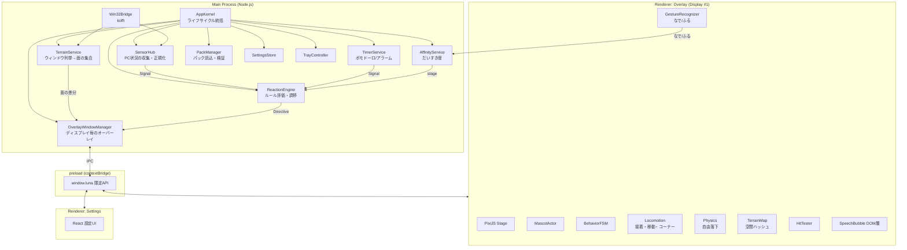
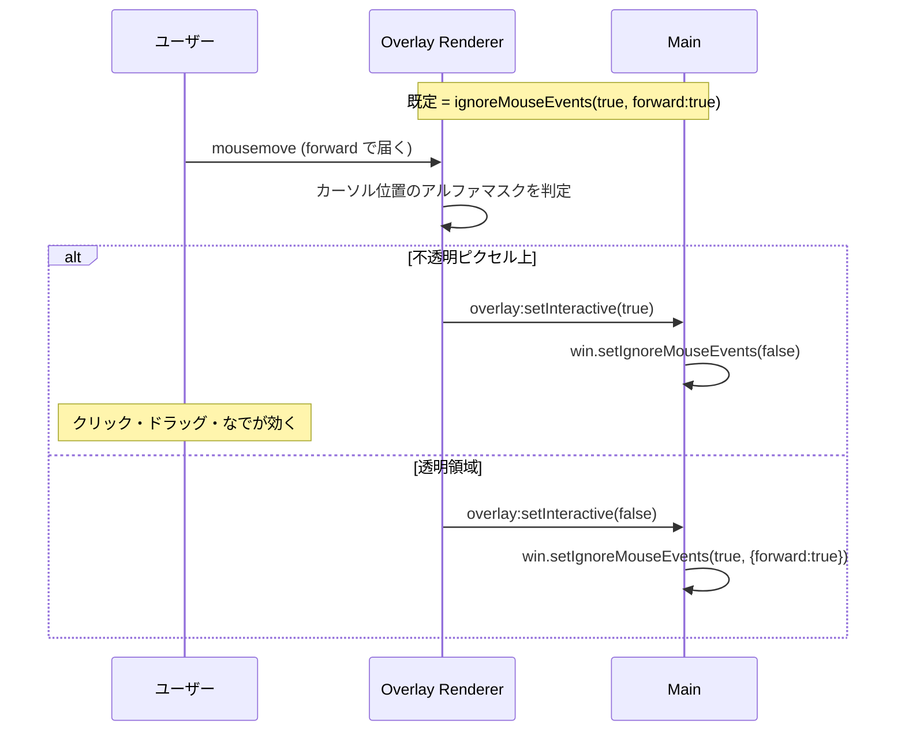
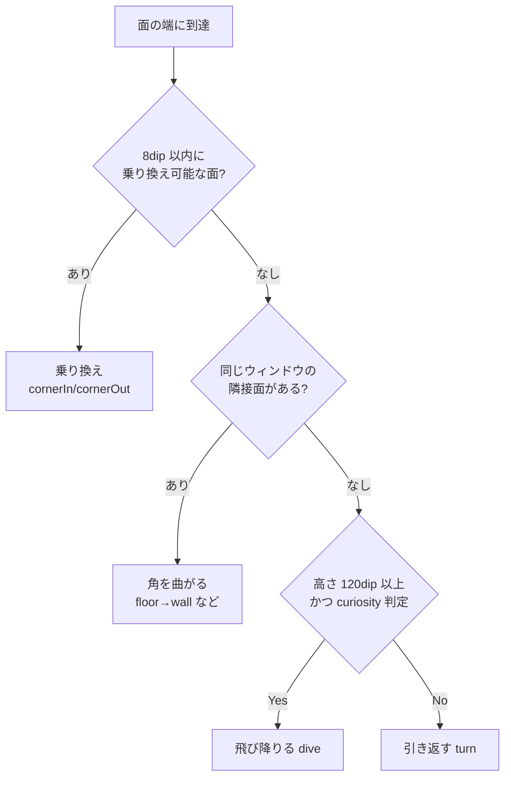
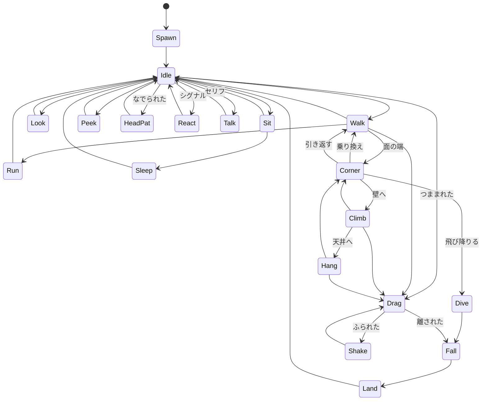
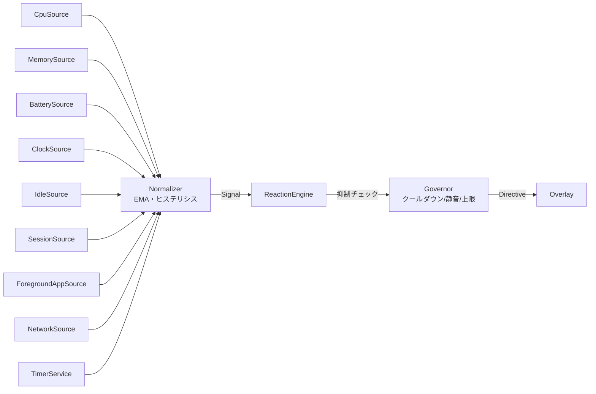

# LUNA — デスクトップマスコット 設計書

> 対象OS: **Windows 10 / 11 (x64)**
> 表現方式: **2D スプライト**
> ランタイム: **Electron + TypeScript + PixiJS**
> スコープ: **マスコット挙動 ＋ 育成 ＋ タイマー ＋ PC 状況連動**
> ドキュメント版数: v1.1（参照作品にもとづき地形・なでなで・親密度・タイマーを追加）

---

## 1. コンセプト

デスクトップの片隅に住みつく、手のひらサイズ（既定 128 dip 相当）のチビキャラ「**ルナ**」。

三つの原則で全ての設計判断を行う。

| # | 原則 | 意味するところ |
|---|------|----------------|
| P1 | **邪魔をしない** | 絶対にフォーカスを奪わない。クリックを吸わない。全画面アプリの上に出ない。喋りすぎない。 |
| P2 | **生きている** | ランダムではなく「文脈」で動く。CPU が唸っていれば汗をかき、深夜には眠そうにする。 |
| P3 | **拡張できる** | キャラは JSON + PNG の「パック」。コードを書かずに差し替え・追加ができる。 |

P1 は特に重要で、デスクトップマスコットが嫌われる原因のほぼ全てが「作業の邪魔」に集約される。
本設計では**クリックスルー**・**フォーカス非奪取**・**クールダウン**・**静音モード**を仕様の中核に置く。

### 1.1 参照作品

本設計は [**Little LUMI Model**](https://store.steampowered.com/app/5075020/Little_LUMI_Model/)（Steam / 2D 手描き / 64 挙動・122 フレーム）を参照点とする。
「デスクトップを地形として扱う」「なでる」「一緒に過ごすほど親しくなる」の三点が、この種のアプリの体験の芯だという理解に立つ。

| 要素 | 本設計の方針 |
|------|-------------|
| デスクトップを地形として扱う（床・壁・天井・ウィンドウの縁） | **踏襲**。§7 で地形モデルとして定式化する |
| ウィンドウの側面を登る / タイトルバーから飛び降りる | **踏襲**。§7.4 コーナー遷移、§9.4 dive |
| 頭をなでる / つかむ・ふる・投げる | **踏襲**。§10 |
| 親密度による段階的な解禁 | **踏襲**。6 段階。ただし**下がらない**設計にする（§11） |
| ポモドーロ・アラーム | **踏襲**。§12 |
| キャラの追加 | **方針変更**。Steam Workshop ではなく**ローカルフォルダ + zip 配布**（§13、CHARACTER_PACK.md） |
| 実績 | **不採用**。常駐アプリに収集要素を足すと起動理由が歪む |
| PC 状況連動（CPU・メモリ・バッテリ・前景アプリ） | **独自**。参照作品には無い。本アプリの差別化点（§13） |

参照作品の「手描き 122 フレーム」という物量は、体験の質がアニメーション量に強く依存することを示している。
**エンジンの機能よりアニメーションの枚数を優先する**という判断を、ロードマップ（M1・M2）に反映している。

---

## 2. 技術選定と根拠

| 領域 | 採用 | 却下した案と理由 |
|------|------|------------------|
| シェル | **Electron 33+** | Tauri: Windows の WebView2 は per-pixel 透過とクリックスルー制御の実績が薄く、`setIgnoreMouseEvents` 相当の手当てが自前になる。Unity: チビ2Dには過剰でビルドが重い。PySide6: アニメーション表現とパッケージングが弱い。 |
| 描画 | **PixiJS v8 (WebGL)** | Canvas2D でも足りるが、色調変化・アウトライン・パーティクル（Zzz、汗、ハート）をフィルタで安く実現でき、複数体表示時のドローコールもまとまる。 |
| 言語 | **TypeScript 5 (strict)** | 状態機械とパックスキーマが型で守れる。 |
| ビルド | **electron-vite** | main / preload / renderer の3ターゲットを1設定で HMR 込み。 |
| 配布 | **electron-builder (NSIS + portable)** | インストーラ版とZIP解凍即実行版の両方を出す。 |
| Win32 呼出 | **koffi** | node-ffi-napi は Node ABI 更新のたびに壊れる。koffi はプリビルド不要かつメンテが活発。 |
| システム情報 | **systeminformation** | CPU/メモリ/バッテリを1ライブラリで賄える。 |
| 設定永続化 | **electron-store** | `%APPDATA%\LUNA\config.json`。スキーマ検証付き。 |
| 検証 | **zod** | パック JSON とIPCペイロードのランタイム検証。 |
| テスト | **Vitest + Playwright(Electron)** | ロジックは単体、ウィンドウ挙動は E2E。 |

### 2.1 Electron を選ぶ上で受け入れるコスト

- 常駐メモリが Tauri より大きい（実測目標は §15 の予算表で縛る）。
- 透過ウィンドウ + ハードウェアアクセラレーションは Windows の一部 GPU ドライバでちらつく事例がある。
  → §5.5 の緩和策（`backgroundThrottling: false`、GPU ブラックリスト時の Canvas2D フォールバック）で対処する。

---

## 3. 全体アーキテクチャ



### 3.1 プロセスとウィンドウの構成

| 種別 | 個数 | 役割 |
|------|------|------|
| Main | 1 | 状態の真実源。地形・センサー・ルール評価・親密度・タイマー・設定。 |
| Overlay Window | **ディスプレイ数と同数** | 各ディスプレイ全体を覆う透過・クリックスルー窓。描画・移動・物理・ジェスチャ認識を担当。 |
| Settings Window | 0 or 1 | 通常の不透明ウィンドウ。必要時のみ生成。 |
| Tray | 1 | 常駐の入口。 |

**「小さい窓を毎フレーム動かす」方式は採らない。**
Windows では `setBounds` を 60Hz で呼ぶと DWM 合成と競合して残像・カクつきが出る上、ドラッグ追従が目に見えて遅れる。
代わりに**ディスプレイ全面の透過窓を1枚張り、その中の canvas 座標でキャラを動かす**。
窓自体は動かないため移動は完全に 60fps で滑らかになり、複数体表示・キャラ同士の相互作用も自然に書ける。

この方式は地形移動（壁を登る・天井にぶら下がる）とも相性が良い。小窓方式では窓の形状を移動のたびに変える必要があるが、全面窓なら単なる座標計算で済む。

代償はクリックスルーの厳密さで、これは §5.3 の per-pixel ヒットテストで解決する。

---

## 4. 座標系

3つの座標系を明確に分離する。混同はマルチモニタ + 混在DPI環境で必ずバグになる。

| 名前 | 定義 | 使う場所 |
|------|------|----------|
| **Virtual (dip)** | 仮想デスクトップ全体の DIP 座標。Electron の `screen` API と同じ。負値もあり得る。 | アクターの正準位置、地形の面、ディスプレイ間の受け渡し |
| **Local (dip)** | あるオーバーレイ窓の左上を原点とした DIP 座標。`local = virtual - display.bounds.origin` | Pixi のステージ座標 |
| **Physical (px)** | Local × `devicePixelRatio` | スプライトの実解像度選択、ヒットマスク |

- アクターの `position` と地形の面は常に **Virtual (dip)**。
- ディスプレイごとに `scaleFactor` が異なる混在DPI環境では、窓の `devicePixelRatio` が異なるため、
  アトラスは **@1x / @2x** を用意し、`devicePixelRatio × 表示倍率` 以上で最小のものを選ぶ（CHARACTER_PACK.md §2.3）。
- Win32 から得られる他アプリのウィンドウ矩形は **Physical** なので、`screen.screenToDipPoint()` で必ず Virtual に変換してから使う。**ここを忘れると 150% DPI 環境で地形が 1.5 倍ずれる。**

### 4.1 ディスプレイ間の引き継ぎ（Actor Handoff）

キャラがモニタ境界を跨ぐときは、**アクターの所有権をオーバーレイ間で移譲**する。

```
Overlay#1 (owner)          Main                    Overlay#2
   |  position.x が                                    |
   |  display1.bounds を                               |
   |  超えた                                           |
   |---- actor:handoff ------->|                       |
   |     {actorId, snapshot}   |---- actor:adopt ----->|
   |                           |                       | 以降 #2 が
   |<--- actor:release --------|                       | シミュレート
```

`snapshot` はアクターの完全な再現に必要な最小状態（位置・速度・向き・現在状態・状態残時間・**接着状態**・パックID・アニメ進行度・親密度キャッシュ）。
毎フレームの IPC は一切行わない。IPC が走るのは境界跨ぎの瞬間だけ。

接着状態（§7.5）は面 ID を含むため、**面 ID はディスプレイ間で一意**でなければならない。`hwnd:0x1234:top` のようにウィンドウハンドル由来の ID を使う（ウィンドウはディスプレイを跨ぐので、これは自然に満たされる）。

---

## 5. オーバーレイウィンドウ設計

### 5.1 BrowserWindow オプション

```ts
new BrowserWindow({
  x: display.bounds.x, y: display.bounds.y,
  width: display.bounds.width, height: display.bounds.height,

  transparent: true,          // 背景を完全透過
  backgroundColor: '#00000000',
  frame: false,
  hasShadow: false,
  resizable: false,
  movable: false,
  minimizable: false,
  maximizable: false,
  fullscreenable: false,

  skipTaskbar: true,          // タスクバーに出さない
  focusable: false,           // ★ P1: 絶対にフォーカスを奪わない
  acceptFirstMouse: true,
  show: false,                // 初期化完了後に showInactive()

  webPreferences: {
    preload,
    contextIsolation: true,
    nodeIntegration: false,
    sandbox: true,
    backgroundThrottling: false, // ★ 非フォーカス時もアニメを止めない
  },
})
```

生成後:

```ts
win.setAlwaysOnTop(true, 'screen-saver')  // 通常ウィンドウより確実に上
win.setVisibleOnAllWorkspaces(true)
win.setIgnoreMouseEvents(true, { forward: true })  // 既定はクリックスルー
win.showInactive()                          // ★ show() は使わない（フォーカスを奪う）
```

`focusable: false` と `showInactive()` の二重掛けが P1 の要。
`show()` や `focus()` は本アプリのオーバーレイに対して**呼ばないことをレビュー観点とする**（lint ルール化を検討）。

### 5.2 常時最前面のレベル選択

`'screen-saver'` レベルは全画面ゲームの上にも出てしまうため、これ単体では P1 に反する。
**「最前面に出す」ことと「全画面を検出して自ら退く」ことをセット**にする（§9.6）。

### 5.3 per-pixel クリックスルー（ヒットテスト）

最も繊細な部分。次の流れで実現する。



実装上の要点:

1. **WebGL の `readPixels` を毎フレーム呼ばない。** 遅い上に GPU 同期が入る。
   代わりに**パック読込時に各フレームのアルファマスクを 1/2 解像度の `Uint8Array` ビットセットへ事前展開**しておく。
   判定は `mask[(y>>1) * strideBits + (x>>1)]` のビット参照のみで、実質ゼロコスト。
2. **ヒステリシス**を入れる。侵入判定は素のマスク、離脱判定はマスクを 3px 膨張させたもので行う。
   輪郭上でカーソルが震えると `setIgnoreMouseEvents` が高速に往復し、クリックが取りこぼされるため。
3. **判定対象はキャラ本体 + 吹き出し矩形 + コンテキストメニュー**。吹き出しは DOM なので矩形判定で足りる。
4. ドラッグ中となで中は判定を止め、強制的に `interactive = true` を維持する（ポインタキャプチャ）。
5. IPC は**状態が変化したときだけ**送る（前回値と比較）。mousemove ごとに送らない。

> **なでなでとの関係**: なで（§10.1）はボタンを押さずにカーソルを往復させる操作なので、
> ヒットテストが不安定だとストロークが途切れて認識率が落ちる。ヒステリシスの膨張量 3px は
> なでの認識率を実測して調整する項目とする。

### 5.4 表示レイヤ構成

オーバーレイ窓の中身は2層。

| z | 層 | 技術 | 理由 |
|---|----|------|------|
| 2 | 吹き出し・コンテキストメニュー・タイマー表示 | **DOM** | テキストのサブピクセル描画とフォント指定が素直。折返し・選択・リンクも DOM が強い。 |
| 1 | キャラクター・エフェクト | **PixiJS canvas** | フィルタ・大量スプライト。 |
| 0 | 背景 | 透過 | 何も描かない。 |

DOM 層は `pointer-events: none` を既定とし、吹き出し要素のみ `auto` にする。

### 5.5 ちらつき・GPU 対策

- `app.disableHardwareAcceleration()` は**しない**（アニメが CPU を食う）。代わりに:
  - 起動時に `app.getGPUFeatureStatus()` を確認し、`gpu_compositing` が無効なら Pixi を `preference: 'canvas'` で初期化するフォールバックを持つ。
  - 既知の問題環境向けに設定で「互換描画モード」を手動 ON にできるようにする。
- ウィンドウ生成直後に一度だけ全面クリアを描く（初期フレームの黒塗り対策）。
- ディスプレイ構成変更 (`display-added` / `display-removed` / `display-metrics-changed`) では
  **窓を作り直す**。既存窓の `setBounds` で追従すると DPI 変更時に canvas が壊れる。

---

## 6. 描画とアニメーション

### 6.1 アセット形式

スプライトシート PNG + TexturePacker 互換 JSON (Hash 形式)。
詳細は [`CHARACTER_PACK.md`](./CHARACTER_PACK.md)。

### 6.2 アニメーション再生

- `AnimationPlayer` が「フレーム配列 + fps + loop」を再生する。可変フレーム尺（フレームごとの `durationMs`）にも対応。
- **描画は固定 30fps を既定、設定で 60fps。** チビキャラのコマ数は 6〜12fps 程度で作られるため、
  30fps でも見た目は変わらず、消費電力が半分になる。移動の滑らかさが要る `walk` / `climb` / `drag` / `fall` の間だけ 60fps に上げる**適応フレームレート**を採る。
- 補間はしない（ドット/セル調の見た目を守るため `NEAREST` スケーリング、`roundPixels: true`）。

### 6.3 アニメーションの物量と優先順位

参照作品は 64 挙動 / 122 フレームを手描きで用意している。本アプリも**エンジンの機能追加よりアニメーション枚数を優先する**。

| 層 | 内容 | 枚数の目安 |
|----|------|-----------|
| **必須** | idle / walk / drag / fall — これが無いと動かない | 10 |
| **地形** | climb / hang / hangMove / cornerIn / cornerOut / dive / land | 25 |
| **操作** | headPat（3段階）/ shake / thrown / pickup | 20 |
| **感情** | happy / surprised / sweat / yawn / stretch / tilt / cheer / sulk | 25 |
| **状態** | sit / sleep / peek / look / run | 20 |
| **親密度解禁** | stage 4–6 の特別待機・甘えるモーション | 20 |
| 合計 | | **約 120** |

「必須」が揃えば動く。以降は**上から順に足すほど生き物らしくなる**という設計にし、パックは欠けたアニメを近いものにフォールバックする（CHARACTER_PACK.md §2.4）。

### 6.4 常駐アプリとしてのループ設計

```ts
// 適応フレームレート: 動きのない状態では requestAnimationFrame を間引く
const target = actor.isMoving || hasActiveEffect || isBeingPatted ? 60 : 30
```

- 全アクターが `idle` かつ吹き出し無し、かつユーザー入力が 5 分ない → **10fps まで落とす**（省電力）。
- 画面ロック中 (`powerMonitor: 'lock-screen'`) → **描画完全停止**（`cancelAnimationFrame`）。
- バッテリー駆動かつ残量 20% 未満 → 上限 30fps に固定。

---

## 7. 地形モデル

参照作品の「デスクトップを地形として扱う」を成立させる中核。
**キャラは画面の下端だけでなく、ウィンドウの上端・下端・左右端を移動できる。**

### 7.1 面（Surface）

地形は**有向線分の集合**として表す。

```ts
type SurfaceKind =
  | 'floor'     // 上に立てる     （法線 = 上）
  | 'ceiling'   // 下からぶら下がれる（法線 = 下）
  | 'wallLeft'  // 面の左側に張り付ける
  | 'wallRight' // 面の右側に張り付ける

type Surface = {
  id: string          // 'display:0:floor' / 'hwnd:0x004213:top' など
  kind: SurfaceKind
  a: Vec2             // Virtual dip。floor/ceiling は水平、wall は垂直
  b: Vec2
  ownerHwnd?: number  // 由来ウィンドウ。消滅・移動の追跡に使う
  z: number           // ウィンドウの Z 順。小さいほど手前
}
```

### 7.2 面の生成元

| 元 | 生成される面 |
|----|-------------|
| ディスプレイ作業領域 | 下端 → `floor`（タスクバーの上）。左右端 → `wallRight`/`wallLeft`（設定「画面外に出ない」が ON のとき）。上端 → `ceiling`（同上） |
| 可視ウィンドウの矩形 | 上端 → `floor`（タイトルバーの上に立つ）／下端 → `ceiling`（窓の下にぶら下がる）／左端 → `wallLeft`／右端 → `wallRight` |

**除外するウィンドウ**（これを怠ると地形がゴミだらけになる）:

- 非表示・最小化 (`IsWindowVisible` が false / `IsIconic`)
- **DWM クローク** (`DwmGetWindowAttribute(DWMWA_CLOAKED)`) — 仮想デスクトップの別ページや UWP のサスペンド窓がここに該当する。**`IsWindowVisible` だけでは弾けない**ので必須。
- ツールウィンドウ (`WS_EX_TOOLWINDOW`)
- 自分自身のオーバーレイ窓
- 幅または高さが 48dip 未満の窓
- 全画面（そのディスプレイを覆う窓）— 面を作らず §9.6 の退避に回す

**遮蔽の扱い**: 手前のウィンドウに完全に隠れている面は捨てる。Z 順で手前から走査し、既出の矩形和に完全内包される面を除外する簡易判定で足りる（部分的な遮蔽は無視。キャラが一瞬窓の裏に立つことがあるが、実害より計算量の方が問題）。

### 7.3 更新戦略

| 状況 | 間隔 |
|------|------|
| 通常 | 500ms |
| いずれかのアクターが移動中／落下中 | 200ms |
| 全アクターが `idle`・`sleep` | 2000ms |
| 「ウィンドウに乗る」設定が OFF | 停止（ディスプレイ由来の面のみ静的に保持） |

Renderer へは**差分のみ**送る（`added` / `removed` / `moved` の面 ID リスト）。全量送信は面が数百になると無視できないコストになる。

> `SetWinEventHook(EVENT_OBJECT_LOCATIONCHANGE)` によるプッシュ型更新は魅力的だが、
> koffi 経由のコールバックは別スレッドから呼ばれるためクラッシュリスクと実装コストが高い。
> **まずポーリングで作り**、§15 の予算を超える場合にのみ検討する。

### 7.4 接着と移動モード

キャラは常に「自由」か「どれかの面に接着」しているかのどちらか。

```ts
type Attachment =
  | { mode: 'free' }                                  // 落下・投げられ・つままれ
  | { mode: 'stand'; surfaceId: string; t: number }   // floor に立つ
  | { mode: 'cling'; surfaceId: string; t: number }   // wall に張り付く
  | { mode: 'hang';  surfaceId: string; t: number }   // ceiling にぶら下がる
```

`t` は線分上の正規化パラメータ (0–1)。**面が移動しても `t` を保てばキャラは面と一緒に動く**——ウィンドウをドラッグすると、その上に立っているキャラが付いてくる。

| 接着 | 使うアニメ | 移動軸 |
|------|-----------|--------|
| `stand` | `walk` / `run` | 水平 |
| `cling` | `climb` | 垂直 |
| `hang` | `hangMove` | 水平（腕でつたう） |

### 7.5 コーナー遷移

面の端に到達したときの分岐。**ここが地形移動の実装の肝**で、判定はこの順に行う。



- **乗り換え**は空間ハッシュ（セル 128dip）で近傍の面を引く。候補が複数なら「同じ向き > 手前(z 小) > 近い」の順に選ぶ。
- **角を曲がる**のは同一ウィンドウ由来の面同士のみ。タイトルバーの端から側面へ降りる動きがこれにあたる。`cornerOut`（凸角）と `cornerIn`（凹角）でアニメを分ける。
- **引き返す**ときは `turn` アニメを挟む。無い場合は単に反転する。

### 7.6 面の消滅と移動

| 事象 | 挙動 |
|------|------|
| 面が**移動**した（ウィンドウをドラッグ） | 接着したまま追従。ただし 1 更新あたりの移動量が **100dip** を超えたら振り落とす（`free` へ）。急にウィンドウを振り回されたら落ちるのが自然だし、面白い |
| 面が**消えた**（ウィンドウを閉じた・最小化した） | 即座に `free` へ。落下開始 |
| 面が**縮んだ**（`t` が範囲外に） | `t` をクランプし、それでも面外なら `free` |
| ディスプレイが消えた | Main が最後の既知位置から、残っているディスプレイの最寄りへ再スポーン |

`free` に落ちたアクターは §8 の物理に従う。

---

## 8. 物理

`Attachment.mode === 'free'` のときだけ働く。単位は dip / 秒。

| パラメータ | 既定値 | 備考 |
|-----------|--------|------|
| 重力 `g` | 1800 dip/s² | 体感で「軽くてよく跳ねる」値 |
| 終端速度 | 2400 dip/s | 高解像度モニタで抜けないための上限 |
| 反発係数 `e` | 0.35 | 着地でひと跳ねする |
| 地面摩擦 | 0.80 /s | 投げた後の滑り |
| 投げ速度 | ドラッグ直近 100ms の平均速度 × 1.2、上限 2000 dip/s | |

積分は**固定タイムステップ (1/120s) のセミインプリシット・オイラー**。描画フレームレートが変動しても挙動が変わらない。

```
accumulator += dt
while (accumulator >= STEP) { integrate(STEP); accumulator -= STEP }
```

### 8.1 衝突

1 ステップの移動を**線分**とみなし、空間ハッシュで近傍の面だけを引いてスイープ交差を取る。高速落下でも面をすり抜けない。

面の種類ごとに扱いが違う。

| 面 | 落下中に当たったとき |
|----|---------------------|
| `floor` | **上から**当たった場合のみ着地 → `stand`。下から突き上げた場合は通過 |
| `ceiling` | **通過する。** 落下中に天井へ勝手にぶら下がるのは不自然。`hang` へは歩行遷移か明示操作でのみ入る |
| `wall`（ウィンドウ由来） | **通過する。** 壁に叩きつけられて張り付くのは不自然 |
| `wall`（画面端由来） | 反発する（`e` を適用）。設定「画面外に出ない」が ON のときのみ存在 |

この非対称な扱いは意図的なもので、「物理的な正しさ」より「キャラとして自然か」を優先している。

---

## 9. 振る舞い設計

### 9.1 状態機械



### 9.2 状態の優先度と割り込み

同時に成立し得る要求を**優先度**で調停する。高い方が低い方を中断できる。

| Pri | 分類 | 例 | 中断可否 |
|-----|------|----|----------|
| 4 | システム緊急 | 全画面アプリ検出による退避、画面ロック、終了 | 全てを即中断 |
| 3 | **タイマー** | アラーム発火、ポモドーロの区切り | Pri 0–2 を中断 |
| 2 | ユーザー操作 | なでる、つかむ、ふる、クリック、右クリック | Pri 0–1 を中断 |
| 1 | リアクション | CPU 高負荷、バッテリー低下、復帰挨拶 | Pri 0 を中断 |
| 0 | 環境（アンビエント） | idle / walk / climb / sit / sleep / peek | 中断される側 |

同 Pri 内では**後勝ちしない**。実行中のものが `interruptible: false`（落下中、着地モーション中、コーナー遷移中）なら、
新しい要求は最大 3 秒キューに保持し、それを過ぎたら破棄する。

**アラームがユーザー操作より上**なのは、ユーザーが自分で設定したものだから。ここは P1（邪魔をしない）の例外として意図的に置いている。

### 9.3 アンビエント行動の選択

各状態は「次に遷移し得る状態と重み」を持つ（パックで定義）。滞在時間は `[minDurationSec, maxDurationSec]` の一様乱数。

重みは**文脈で補正**される:

| 文脈 | 補正 |
|------|------|
| 深夜 (23:00–05:00) | `sleep` ×4, `run` ×0.2 |
| ユーザー無操作 5 分以上 | `sleep` ×3, `walk` ×0.5 |
| 前景アプリがゲーム/会議 | 全ての移動系 ×0.1（静かにする） |
| **ポモドーロの作業中** | 移動系 ×0.1、`talk` 禁止 |
| **ポモドーロの休憩中** | 移動系 ×2、`talk` ×2 |
| 静音モード ON | `talk` を完全に禁止、移動系 ×0.3 |
| バッテリー 20% 未満 | 移動系 ×0.3 |
| **だいすき度 stage ≥ 4** | カーソル追従・甘えるモーション系を解禁 |

補正は**乗算した上で正規化**する。パック側は「素の性格」だけを書けばよく、環境適応はエンジンが行う。

### 9.4 dive（意味もなく飛び降りる）

参照作品の *"she will dive off a title bar for no reason at all"* を再現する。

- 条件: `stand` 中、面の高さが**床から 120dip 以上**、面の端に到達、かつ乗り換え先が無い
- 確率: `3% × personality.curiosity × 2`（既定 `curiosity: 0.6` で約 3.6%）
- 動作: `dive` アニメ → `free` → 落下 → `land`
- 着地地点に別の面があればそこに乗る。無ければ床まで落ちる

**滅多に起きないこと**が重要で、頻発すると「落ちてばかりのキャラ」になる。既定値は控えめに置き、設定の「活発さ」で倍率を変える。

### 9.5 カーソルへの興味

`personality.curiosity` に応じて、たまにカーソルの方を見る／近づく。
だいすき度 stage 4 以上では、カーソルが長く止まっているとその近くへ寄っていく（`moveTo: cursor` 相当のアンビエント行動）。

### 9.6 全画面アプリからの退避（P1 の中核）

前景ウィンドウがあるディスプレイ全体を覆っている、または排他全画面のとき:

1. そのディスプレイのオーバーレイを 200ms でフェードアウトし、`win.hide()`。
2. 状態は保持（位置・接着・状態を凍結）。
3. 全画面が解除されたら `showInactive()` + フェードイン、`peek`（覗き込み）から復帰する。

判定は `GetForegroundWindow` + `GetWindowRect` + `GetWindowLong(GWL_STYLE)` で行い、2 秒間隔でポーリングする。
**UAC の同意画面（セキュアデスクトップ）**は別デスクトップなのでそもそも描画されないが、復帰時に位置がずれないことをテスト項目に含める。

---

## 10. ユーザー操作

参照作品の *"Rub the top of her head with the mouse and Lumi lights up; pick her up, shake her, throw her across the screen"* を成立させる。
**クリックだけでは足りない。** なでる・ふるといった連続的なジェスチャの認識が要る。

### 10.1 なでなで（head pat）

本アプリで最も気持ちよくすべき操作。ここの認識精度が体験を決める。

**頭部領域**はパックが `display.headRegion`（フレーム基準の相対矩形）で定義する。未定義ならスプライト上部 35% を頭とみなす。

認識アルゴリズム:

```
1. カーソルが頭部領域内、かつボタン非押下、かつ移動している → なで候補
2. カーソルの水平速度の符号が反転し、直前の移動距離が 6dip 以上 → 「1ストローク」
3. 0.6 秒以内に 2 ストローク成立 → headPat.start を発火
4. ストロークが 1.0 秒途切れる or 頭部領域を離れる → headPat.end
5. なで中は patEnergy を 1 ストロークにつき +1
```

**3段階の反応**（アニメが揃っていれば）:

| ストローク数 | 反応 |
|-------------|------|
| 2–3 | `headPat_soft` — 目を細める |
| 4–7 | `headPat_happy` — 表情が明るくなる（参照作品の "lights up"） |
| 8+ | `headPat_bliss` — とろける。`heart` エフェクト |

**乱用対策**: 1 セッション（`start` から `end` まで）で親密度に加算されるのは**上限 5 ポイント**。
セッション終了後 **30 秒**は再加算しない。連打で数値を伸ばす遊びにさせない。

**なで中はヒットテストを固定**する（§5.3-4）。輪郭上でカーソルが往復するため、ここを止めないとストロークが途切れる。

### 10.2 つかむ・ふる・投げる

| 操作 | 検出 | 反応 |
|------|------|------|
| つかむ | 本体上で mousedown | `pickup` → `drag`。接着を解除して `free` へ |
| はこぶ | ドラッグ中の移動 | `drag`。カーソルに追従（1 フレーム遅れの補間で「ぶら下がってる感」を出す） |
| **ふる** | ドラッグ中、0.5 秒以内に速度の符号が **4 回**反転、各振幅 20dip 以上 | `shake` — 目を回す。`dust` エフェクト |
| 投げる | mouseup 時の速度が 300dip/s 以上 | 直近 100ms の平均速度 × 1.2 で射出（§8） |
| そっと置く | mouseup 時の速度が 300dip/s 未満 | 速度 0 で `free` → 短く落下 → `land` |

**ふる**は親密度を**増やしも減らしもしない**。減点は罪悪感を生むだけで常駐アプリに向かない（§11 と同じ判断）。
ただし直後に少しだけ `sulk`（すねる）を挟む余地は残す — これは「反応がある」だけで、罰ではない。

### 10.3 クリック・右クリック

| 操作 | 反応 |
|------|------|
| 左クリック（移動を伴わない） | `interactions.click`。クールダウン 3 秒 |
| ダブルクリック | `interactions.doubleClick` |
| 右クリック | ネイティブのコンテキストメニュー（§14.2） |
| ホバー（1 秒静止） | `interactions.hover`。こちらを見る |

なで（10.1）とクリックは競合する。**mousedown を伴わない往復移動**がなで、**押して離す**がクリックなので、状態機械上は排他になる。

### 10.4 トレイから呼ぶ

トレイアイコンの左クリックで、**カーソルのあるディスプレイのカーソル付近**へ移動する。
探しに行く手間をゼロにする導線で、複数モニタ環境では必須。

---

## 11. だいすき度（親密度）

参照作品の *"Days spent together and head pats add up through six stages"* を踏襲する。

### 11.1 段階

| Stage | 名称 | 必要スコア | 解禁されるもの |
|-------|------|-----------|---------------|
| 1 | はじめまして | 0 | 基本のセリフとモーション |
| 2 | なかよし | 30 | 挨拶のバリエーション、`happy` の反応 |
| 3 | ともだち | 100 | 独り言、時報の口調が砕ける |
| 4 | あいぼう | 250 | カーソルに寄ってくる、名前で呼ぶ |
| 5 | だいすき | 600 | 甘えるモーション、特別な待機 |
| 6 | ずっといっしょ | 1200 | 記念日のセリフ、限定アニメ |

### 11.2 スコアの加算

| 行動 | 加点 | 1日の上限 |
|------|------|----------|
| その日はじめての起動 | +10 | — |
| 連続起動ボーナス | +min(連続日数, 7) | — |
| なで 1 ストローク | +1 | 30 |
| リアクションを見た | +0.5 | 10 |
| ポモドーロを 1 セット完走 | +3 | 12 |

最短で stage 6 まで**およそ 4〜6 週間**。毎日開いて時々なでる人が、季節が変わる頃に到達する速度に置いている。

### 11.3 下がらない

**スコアは減らない。** 放置しても、乱暴に扱っても下がらない。

育成ゲームの定石は「放置でパラメータが下がる」だが、**常駐アプリでそれをやると、起動していないことへの罪悪感を生む**。
それは P1（邪魔をしない）に真っ向から反する。連続日数ボーナスが途切れるだけで十分な動機付けになる。

### 11.4 永続化

`%APPDATA%\LUNA\affinity.json`。パック ID ごとに独立（キャラを変えても前のキャラの記録は残る）。

```jsonc
{
  "version": 1,
  "packs": {
    "luna": {
      "score": 342, "stage": 4, "patCount": 210,
      "firstMetAt": "2026-07-14T09:12:00+09:00",
      "lastSeenDate": "2026-09-05",
      "streakDays": 12,
      "daily": { "date": "2026-09-05", "patPoints": 4, "reactionPoints": 2, "pomodoroPoints": 6 }
    }
  }
}
```

**改ざん対策はしない。** ローカル単機能アプリで、守る価値より複雑さのコストが勝る。
代わりに設定画面に「記録をリセット」を明示的に置く（隠すと不信感になる）。

日付の判定はローカルタイムの暦日。日付が飛んだ（システム時計が巻き戻った）場合は `lastSeenDate` を更新するだけで加点しない。

### 11.5 セリフの段階解禁

`dialogue` の各行に `minStage` を付けられる（CHARACTER_PACK.md §3）。
発話時は「現在の stage 以下の行」からランダムに選ぶため、**stage が上がるほど語彙が増える**。行を消さないのが要点で、
古いセリフも出続けることで「変わってしまった」感を避ける。

---

## 12. タイマー（ポモドーロ・アラーム）

参照作品の *"a Pomodoro timer where Lumi moves between focus and break on her own"* と
*"when alarm time comes she sounds a siren and runs around the floor"* を踏襲する。

**マスコットにタイマーを持たせる意義**は、通知が「視界の中で動く」ことにある。トースト通知は見落とすが、走り回るキャラは見落とさない。

### 12.1 ポモドーロ

| 設定 | 既定 |
|------|------|
| 作業 | 25 分 |
| 小休憩 | 5 分 |
| 長休憩 | 15 分 |
| 長休憩までのセット数 | 4 |

- **作業中**: 自動で集中モードに入る。隅に座り、移動を最小化し、発話を禁止（§9.3 の重み補正）。
- **区切り**: 立ち上がって伸びをし、`cheer` → 「休憩しよ！」。ここは Pri 3 なので確実に割り込む。
- **休憩中**: 移動と発話の重みを上げる。休憩らしく動き回る。
- **進捗表示**: 足元に細いバー（幅 = キャラ幅、高さ 3dip）。設定で OFF。
- キャラをクリックすると一時停止／再開。右クリックメニューからスキップ。

**自動起動はしない。** ユーザーが明示的に開始したときだけ動く。「作業を検知して勝手に計測」は監視されている感が強く、P1 に反する。

### 12.2 アラーム

時刻を指定して発火。**主張度を 3 段階から選ぶ**。

| 主張度 | 挙動 |
|--------|------|
| しずか | 吹き出しのみ。音なし |
| ふつう | 通知音 + 手を振る + 吹き出し |
| **おおごと** | サイレン + 床を走り回る + 画面中央へ移動（参照作品の再現） |

- クリックで停止。スヌーズは 5 分（設定可）。
- 5 分間操作が無ければ自動で「しずか」に落として鳴り止む（無限に走り回らせない）。
- 全画面アプリで退避中に発火した場合は、**音だけ鳴らして退避は維持**する。ゲームの上に飛び出してはいけない。

### 12.3 Governor との関係

タイマー由来の発話は **Governor の発話上限（§13.3）をバイパス**する。
ユーザーが明示的に設定したものであり、抑制すると機能として壊れるため。これは意図的な例外として明記する。

一方、**静音モードは尊重する**（音を鳴らさず、モーションと吹き出しのみ）。ミュートは明示的な意思表示だから。

---

## 13. PC 状況連動

参照作品には無い、本アプリ独自の要素。**センサー → シグナル → ルール → リアクション**の4段で組む。



### 13.1 センサー一覧

| ソース | 取得手段 | 周期 | 生成シグナル |
|--------|----------|------|-------------|
| CPU | `systeminformation.currentLoad()` | 3s | `cpu.high` (>80%), `cpu.sustainedHigh` (>80% が 30s 継続), `cpu.calm` |
| メモリ | `systeminformation.mem()` | 10s | `mem.high` (>85%) |
| バッテリ | `systeminformation.battery()` | 30s + 電源イベント | `battery.low` (<20%), `battery.critical` (<10%), `battery.charging`, `battery.full` |
| 時刻 | 分境界に整列したタイマー | 60s | `time.hourly`, `time.morning/noon/evening/lateNight` |
| 無操作 | `powerMonitor.getSystemIdleTime()` | 15s | `user.away` (>300s), `user.back` |
| セッション | `powerMonitor` イベント | イベント | `session.lock`, `session.unlock`, `session.suspend`, `session.resume` |
| 前景アプリ | `Win32Bridge.getForegroundApp()` | 2s | `app.changed` (exe名/カテゴリ), `app.fullscreen` |
| ネットワーク | `net.isOnline()` + イベント | イベント | `net.offline`, `net.online` |
| ディスプレイ | `screen` イベント | イベント | `display.changed` |
| **タイマー** | `TimerService` | イベント | `pomodoro.focusStart`, `pomodoro.breakStart`, `pomodoro.setDone`, `alarm.fired` |
| **親密度** | `AffinityService` | イベント | `affinity.stageUp` |

**前景アプリのカテゴリ分類**は同梱の分類表（exe名 → `editor` / `browser` / `terminal` / `game` / `meeting` / `media` / `office` / `other`）で行い、ユーザーが追加・上書きできる。
分類表はパックではなくアプリ本体の設定に置く（キャラを変えても分類は共通であるべきなので）。

### 13.2 正規化のルール

生値をそのまま流すとリアクションが暴れる。Normalizer が次を担う。

- **EMA 平滑化**: CPU は α=0.3 の指数移動平均。瞬間的なスパイクで反応しない。
- **シュミットトリガ**: `cpu.high` は 80% で ON、**65% まで下がって初めて OFF**。境界での振動を防ぐ。
- **持続条件**: `sustainedHigh` は「ON 状態が連続 30 秒」を満たしたときにのみ 1 度だけ発火。
- **立ち上がりのみ通知**: 状態系シグナルは `enter` / `exit` のエッジで発火し、継続中は発火しない。

### 13.3 リアクションの調停（Governor）

「反応して欲しい」と「うるさい」の境界を守るための抑制層。

| 抑制 | 既定値 |
|------|--------|
| ルール個別クールダウン | ルールごとに定義（例: CPU 高負荷は 15 分） |
| グローバル発話上限 | **6 回/時**、かつ最短間隔 90 秒 |
| 静音モード | 発話と音を全面禁止、モーションのみ許可 |
| 集中モード（自動） | 前景が `game` / `meeting` の間、およびポモドーロ作業中は Pri 1 以下を全て抑制 |
| 就寝時間帯 | 設定した時間帯は発話禁止（既定 OFF） |
| 起動直後 | 起動から 60 秒はリアクション抑制（起動時のスパイクで反応しないため） |
| **例外** | **Pri 3（タイマー）は上限をバイパス**（§12.3） |

抑制されたリアクションは**キューに積まず捨てる**。溜めて後で一気に喋るのは最悪の体験なので。

### 13.4 リアクション例（既定パック）

| シグナル | 反応 |
|----------|------|
| `cpu.sustainedHigh` | 汗をかくアニメ + 「うわ、パソコンあつあつだよ…」 |
| `battery.low` | コンセントを指差す + 「そろそろ充電しよ？」 |
| `battery.charging` | 嬉しそうに跳ねる（発話なし） |
| `user.back`（30 分以上の離席後） | 手を振る + 「おかえり！」 |
| `session.unlock` | 伸びをする |
| `time.lateNight` (深夜1時) | あくび + 「そろそろ寝よ…？」 |
| `app.changed` → `game` | 隅に移動して静かに座る（発話なし） |
| `net.offline` | 首をかしげる |
| `affinity.stageUp` | 特別なモーション + 段階に応じた一言 |

**「発話なし」の反応を多めに用意するのが体感品質の鍵。** モーションだけの反応はうるさくならない。

---

## 14. UI

### 14.1 トレイメニュー

```
LUNA
├─ ルナを呼ぶ          (カーソルのあるディスプレイのカーソル付近へ)
├─ 隠す / 表示         (トグル)
├─ 静音モード          (チェック)
├─ ─────────
├─ ポモドーロ ▸        開始 / 一時停止 / スキップ / 停止
├─ アラーム…
├─ ─────────
├─ キャラクター ▸      (インストール済みパック一覧・ラジオ)
├─ ふやす / へらす     (体数 1–5)
├─ ─────────
├─ 設定…
├─ LUNA について       (だいすき度と一緒に過ごした日数を表示)
└─ 終了
```

トレイ左クリックで「呼ぶ」、右クリックでメニュー。

### 14.2 キャラ右クリックメニュー

`なでる` / `おしゃべり` / `ここに固定` / `ポモドーロ開始` / `しまう` / `設定…`

### 14.3 設定ウィンドウ

| タブ | 内容 |
|------|------|
| 基本 | 起動時に自動起動、体数、表示サイズ (75–200%)、対象ディスプレイ、フレームレート |
| ふるまい | 活発さ（3段階）、**ウィンドウに乗る/登る ON/OFF**、**飛び降りる頻度**、投げられるか、画面外に出ない |
| おしゃべり | 静音モード、発話頻度、就寝時間帯、時報 |
| **タイマー** | ポモドーロの各時間、進捗バー表示、アラーム一覧と主張度、スヌーズ |
| **だいすき度** | 現在の段階・スコア・一緒に過ごした日数・なでた回数、リセット |
| 連動 | センサー個別の ON/OFF としきい値、前景アプリ分類の編集 |
| キャラクター | パック一覧、フォルダを開く、再読込、検証エラー表示 |
| 詳細 | 互換描画モード、ログレベル、設定のエクスポート/インポート |

### 14.4 吹き出し

- キャラの頭上に出す。画面端では自動的に反対側へ反転。**壁に張り付いている / 天井にぶら下がっているときは向きを変える。**
- 表示時間 = `max(2.5s, 文字数 × 0.12s)`、上限 8 秒。クリックで即閉じ。
- 表示中に新しい発話が来たら**差し替えず、破棄**する（Pri 3 のタイマー由来を除く）。
- 文字送りアニメ（1 文字 25ms）。設定で OFF 可。

---

## 15. 性能予算

**守れなければ設計を見直す**という意味での予算。リリース前チェックリストに入れる。

| 指標 | 目標 | 上限 |
|------|------|------|
| アイドル時 CPU（1体・30fps） | < 1.0% | 2.0% |
| 移動時 CPU（1体・60fps） | < 2.5% | 4.0% |
| 常駐メモリ（Main + Overlay 1枚） | < 180 MB | 250 MB |
| 起動からキャラ表示まで | < 1.5 s | 3.0 s |
| GPU メモリ | < 60 MB | 120 MB |
| ヒットテスト 1 回 | < 0.05 ms | 0.2 ms |
| **地形スキャン 1 周（窓 50 枚）** | **< 8 ms** | **20 ms** |
| センサー1周期の Main 占有 | < 15 ms | 40 ms |

主要な削減手段:

- `backgroundThrottling: false` を入れる代わりに**自前で間引く**（§6.4）。
- センサーは全て Main の**単一スケジューラ**で回し、タイマーを乱立させない（タイマー起床は電力を食う）。
- 地形スキャンはアクターの状態に応じて間隔を変える（§7.3）。全アクターが寝ていれば 2 秒に 1 回で十分。
- 地形の差分だけを Renderer へ送る。
- 未使用ディスプレイ（キャラが 1 体もいない）のオーバーレイは描画ループを止める。

---

## 16. セキュリティとプライバシー

デスクトップ常駐かつ「サードパーティのキャラパックを読む」ため、攻撃面を明確に閉じる。

| 項目 | 方針 |
|------|------|
| Renderer 権限 | `contextIsolation: true` / `nodeIntegration: false` / `sandbox: true` |
| API 露出 | preload の `contextBridge` で**列挙した関数のみ**。`ipcRenderer` を直接渡さない。 |
| CSP | `default-src 'none'; script-src 'self'; style-src 'self' 'unsafe-inline'; img-src 'self' data: blob:; font-src 'self'; media-src 'self'` |
| **パックはデータのみ** | **パック内で JavaScript を一切実行しない。** 振る舞いは宣言的 JSON（CHARACTER_PACK.md の条件 DSL）で表現する。ここを緩めると、キャラ配布がそのまま任意コード実行の配布路になる。 |
| パック検証 | zod スキーマ + 追加検証（画像 4096² 以下、総容量 64MB 以下、フレーム 512 以下） |
| パス | パックのファイル参照は**パックルート配下に正規化して閉じ込める**。`..` とドライブ指定を拒否。シンボリックリンクは辿らない。 |
| ネットワーク | アプリ本体は**既定で一切通信しない**。更新確認は明示的に ON にしたときのみ。 |
| **ウィンドウタイトル** | 地形スキャンで得られるウィンドウタイトルは**保持しない**（矩形と hwnd のみ使う）。前景アプリ判定でも exe 名までとし、タイトルはメモリ上でも即破棄する。 |
| ログ | 既定の情報レベルでは exe 名・ウィンドウタイトルを残さない。デバッグレベル（既定 OFF）でのみ exe 名を出す |
| 収集データ | センサー値・親密度は**ローカル完結**。ディスクに出るのは `affinity.json` と `config.json` のみ。ネットワークには一切出ない |
| ナビゲーション | `will-navigate` / `setWindowOpenHandler` で外部遷移を全拒否 |
| Win32 呼出 | koffi の呼出は `Win32Bridge` に集約し、引数は全て型付きラッパ経由。生ポインタを外へ出さない |

**プライバシー上の最重要点は地形スキャン**。ウィンドウの列挙は「今どのアプリで何をしているか」を映す情報なので、
**矩形と hwnd 以外を保持しない**ことを実装規約とし、コードレビューの観点に入れる。

---

## 17. ディレクトリ構成

```
LUNA/
├─ package.json
├─ electron.vite.config.ts
├─ electron-builder.yml
├─ tsconfig.json
├─ docs/
│  ├─ DESIGN.md              ← 本書
│  ├─ CHARACTER_PACK.md      ← パック仕様
│  └─ ROADMAP.md             ← 実装計画
├─ packs/
│  └─ luna/                  ← 既定キャラ
│     ├─ mascot.json
│     ├─ sprites/luna@1x.png / luna@1x.json / @2x…
│     └─ dialogue/ja.json
├─ src/
│  ├─ shared/
│  │  ├─ types/{actor,surface,signal,pack,settings,affinity}.ts
│  │  └─ ipc/channels.ts     ← チャンネル名と型の単一定義
│  ├─ main/
│  │  ├─ index.ts
│  │  ├─ kernel/AppKernel.ts
│  │  ├─ window/{OverlayWindowManager,SettingsWindow,TrayController}.ts
│  │  ├─ terrain/{TerrainService,SurfaceBuilder,OcclusionFilter}.ts
│  │  ├─ sensor/SensorHub.ts
│  │  ├─ sensor/sources/{cpu,memory,battery,clock,idle,session,foregroundApp,network}.ts
│  │  ├─ sensor/Normalizer.ts
│  │  ├─ reaction/{ReactionEngine,Governor,ConditionEvaluator}.ts
│  │  ├─ affinity/AffinityService.ts
│  │  ├─ timer/{TimerService,Pomodoro,AlarmScheduler}.ts
│  │  ├─ pack/{PackManager,PackSchema,AlphaMaskBuilder}.ts
│  │  ├─ platform/win32/{Win32Bridge,WindowEnumerator,ForegroundWatcher}.ts
│  │  └─ store/{SettingsStore,AffinityStore}.ts
│  ├─ preload/index.ts
│  └─ renderer/
│     ├─ overlay/
│     │  ├─ main.ts
│     │  ├─ MascotActor.ts
│     │  ├─ BehaviorFSM.ts
│     │  ├─ Locomotion.ts        ← 接着・移動・コーナー遷移
│     │  ├─ TerrainMap.ts        ← 空間ハッシュ
│     │  ├─ Physics.ts
│     │  ├─ GestureRecognizer.ts ← なで・ふる
│     │  ├─ HitTester.ts
│     │  ├─ DragController.ts
│     │  ├─ AnimationPlayer.ts
│     │  └─ SpeechBubble.ts
│     └─ settings/            ← React
└─ tests/
   ├─ unit/{fsm,locomotion,physics,terrain,gesture,governor,affinity,packSchema}.spec.ts
   └─ e2e/{overlay,hittest,multiDisplay}.spec.ts
```

---

## 18. IPC 契約

全チャンネルを `src/shared/ipc/channels.ts` に型付きで一元定義する。文字列リテラルの直書きを禁止。

### Renderer → Main

| チャンネル | 種別 | ペイロード | 用途 |
|-----------|------|-----------|------|
| `overlay:ready` | send | `{ displayId }` | 初期化完了通知 |
| `overlay:setInteractive` | send | `{ interactive }` | クリックスルー切替（§5.3） |
| `actor:handoff` | send | `{ actorId, snapshot, toDisplayId }` | ディスプレイ跨ぎ |
| `actor:contextMenu` | send | `{ actorId, x, y }` | ネイティブメニュー表示要求 |
| `gesture:headPat` | send | `{ actorId, strokes, phase }` | なで（親密度加算） |
| `gesture:shake` | send | `{ actorId }` | ふる |
| `timer:control` | send | `{ action: 'start'\|'pause'\|'skip'\|'stop' }` | キャラ経由のタイマー操作 |
| `settings:get` / `settings:set` | invoke | | 設定の読み書き |
| `pack:list` / `pack:load` | invoke | | パック情報 |

### Main → Renderer

| チャンネル | ペイロード | 用途 |
|-----------|-----------|------|
| `actor:spawn` / `actor:despawn` | `{ actorId, packId, position }` | 生成・消滅 |
| `actor:adopt` | `{ snapshot }` | 引き継ぎ受領 |
| `terrain:patch` | `{ displayId, added[], removed[], moved[] }` | **地形の差分**（§7.3） |
| `directive:react` | `{ actorId, reactionId, actions }` | リアクション実行指示 |
| `directive:say` | `{ actorId, text, durationMs, bypassBubbleGuard? }` | 発話 |
| `env:contextChanged` | `{ timeOfDay, quiet, focusMode, batteryState, affinityStage }` | 行動重み補正の入力 |
| `timer:state` | `{ mode, remainingSec, setIndex }` | ポモドーロの表示更新 |
| `overlay:visibility` | `{ visible, fadeMs }` | 全画面退避 |
| `settings:changed` | `Partial<Settings>` | 設定反映 |

**方針**: 毎フレームの IPC は存在しない。IPC はイベント駆動のみ。
唯一の高頻度候補は `terrain:patch`（最短 200ms）だが、差分のみなので通常は数バイト。

---

## 19. 設定スキーマ（抜粋）

```ts
type Settings = {
  version: 1
  general: {
    launchAtLogin: boolean          // false
    mascotCount: number             // 1  (1–5)
    scalePercent: number            // 100 (75–200)
    targetDisplays: 'all' | 'primary' | string[]
    frameRate: 30 | 60
    compatRendering: boolean        // false
  }
  behavior: {
    activity: 'calm' | 'normal' | 'lively'   // 'normal'
    climbWindows: boolean           // true  ← 地形（窓）を使うか
    diveFrequency: 'never' | 'rare' | 'often'  // 'rare'
    throwable: boolean              // true
    keepOnScreen: boolean           // true  ← 画面端を壁にするか
  }
  speech: {
    quietMode: boolean              // false
    maxPerHour: number              // 6
    minIntervalSec: number          // 90
    quietHours: { enabled: boolean; from: string; to: string } // 無効, "23:00"–"07:00"
    hourlyChime: boolean            // false
    typewriter: boolean             // true
  }
  timer: {
    pomodoro: { focusMin: number; shortBreakMin: number; longBreakMin: number; setsPerLongBreak: number } // 25/5/15/4
    showProgressBar: boolean        // true
    alarms: Array<{ id: string; time: string; label: string; intensity: 'quiet'|'normal'|'loud'; enabled: boolean; days: number[] }>
    snoozeMin: number               // 5
  }
  sensors: Record<SensorId, { enabled: boolean; threshold?: number }>
  appCategories: Record<string, AppCategory>   // "chrome.exe" -> "browser"
  packs: { activePackId: string; installedPaths: string[] }
}
```

保存先 `%APPDATA%\LUNA\config.json`。スキーマ変更時は `version` によるマイグレーション関数を必ず用意する。
親密度は別ファイル `affinity.json`（§11.4）——**設定のリセットで思い出まで消えないように分ける。**

---

## 20. テスト方針

| 層 | 対象 | 手段 |
|----|------|------|
| 単体 | BehaviorFSM の遷移・重み補正 | Vitest（乱数はシード注入で決定論化） |
| 単体 | **Locomotion のコーナー遷移**（乗り換え / 角 / dive / 引き返す の分岐） | Vitest（合成地形で全分岐を網羅） |
| 単体 | **TerrainService の面生成・除外・遮蔽** | Vitest（ウィンドウ列挙をモック） |
| 単体 | Physics（着地・反発・すり抜け・面種別の扱い） | Vitest（固定タイムステップなので完全に決定論的） |
| 単体 | **GestureRecognizer**（なでのストローク検出、ふるの誤検出） | Vitest（カーソル軌跡を合成入力で与える） |
| 単体 | **AffinityService**（加点上限、日付跨ぎ、時計巻き戻し） | Vitest（仮想時計） |
| 単体 | Governor の抑制ロジックと Pri 3 のバイパス | Vitest（仮想時計） |
| 単体 | パックスキーマ検証・パストラバーサル拒否 | Vitest |
| 単体 | Normalizer のシュミットトリガ | Vitest |
| 結合 | オーバーレイ生成・透過・クリックスルー | Playwright(Electron) |
| 手動 | 混在DPI 2画面、全画面ゲーム、モニタ抜き差し、スリープ復帰、実ウィンドウ地形 | チェックリスト（§21） |

乱数と時刻は**必ず注入**する。`Math.random()` と `Date.now()` の直呼びを lint で禁止し、`Clock` / `Rng` インターフェース経由に統一する。
これがないと振る舞い・親密度・タイマーはテストできない。

ジェスチャ認識は**軌跡データを固定資産として持つ**（実際になでた／ふった記録を JSON で保存し、回帰テストの入力にする）。閾値を触ったときの影響がすぐ分かる。

---

## 21. リリース前手動チェックリスト

**基本**
- [ ] 100% / 150% / 200% の混在DPI 2画面でキャラが正しい大きさで表示され、境界を跨げる
- [ ] キャラの透明部分のクリックが背後のアプリに通る
- [ ] アプリ起動でどのウィンドウからもフォーカスを奪わない
- [ ] タスクマネージャに常駐 CPU が張り付かない（アイドル < 1%）

**地形**
- [ ] エディタのタイトルバーの上を歩ける
- [ ] ウィンドウの側面を登り、下端にぶら下がれる
- [ ] タイトルバーの端から意味もなく飛び降りることがある（頻繁すぎない）
- [ ] 乗っているウィンドウをドラッグすると付いてくる。速く振ると落ちる
- [ ] 乗っているウィンドウを閉じる／最小化すると落下する
- [ ] 仮想デスクトップを切り替えても、別ページの窓が地形に混ざらない（DWM クローク）
- [ ] キャラをドラッグして投げたとき、タスクバー上に着地する

**操作**
- [ ] 頭をなでると 3 段階で反応が変わる
- [ ] なでている最中にヒットテストが外れて途切れない
- [ ] つかんで振ると目を回す
- [ ] トレイ左クリックでカーソルのあるモニタに来る

**タイマー・親密度**
- [ ] ポモドーロ作業中は静かになり、休憩開始で確実に割り込む
- [ ] アラーム「おおごと」でサイレンと走り回りが発火し、クリックで止まる
- [ ] 全画面ゲーム中のアラームは音だけ鳴り、キャラは出てこない
- [ ] 日付を跨いで起動すると連続日数が増える。時計を巻き戻しても増えない
- [ ] なで連打でスコアが上限を超えない

**節度**
- [ ] 起動〜1時間の（タイマー以外の）発話が上限 6 回を超えない
- [ ] 静音モードで一切喋らず、音も鳴らない
- [ ] 全画面ゲーム起動でキャラが消え、終了で同じ位置に戻る
- [ ] スリープ→復帰でアニメが再開し、CPU が張り付かない
- [ ] モニタを抜く/挿すでキャラが画面外に取り残されない

---

## 22. リスクと対策

| リスク | 影響 | 対策 |
|--------|------|------|
| **地形スキャンのコスト**が予算を超える | 常駐 CPU 上昇 | アクター状態に応じた可変間隔（§7.3）、差分送信、遮蔽判定の簡略化。それでも駄目なら WinEventHook 化を検討 |
| **地形が汚れる**（見えない窓が面になる） | キャラが虚空に立つ | DWM クローク・ツールウィンドウ・最小化の除外を必須実装とし、テスト項目に入れる |
| **コーナー遷移のバグ**で嵌る／消える | 体験の破壊 | Locomotion を純粋関数として切り出し、合成地形で全分岐を単体テスト。5 秒ごとの生存確認で異常なら床へ再配置 |
| 透過ウィンドウの GPU ちらつき | 表示崩れ | 互換描画モード、GPU 状態による自動フォールバック（§5.5） |
| `setIgnoreMouseEvents` の往復でなでが途切れる | 主要操作が効かない | ヒステリシス + なで中の固定（§5.3, §10.1） |
| koffi / Win32 呼出でアンチウイルス誤検知 | 起動不能 | 「ウィンドウに乗る」を設定で OFF にでき、**OFF でも床の上では全機能が動く**よう地形層を分離。署名付きインストーラを配布 |
| キャラパックの悪意ある内容 | 任意コード実行 | パックは**データのみ**、JS を実行しない（§16） |
| ウィンドウタイトルの取得がプライバシー懸念に | 信用の喪失 | 矩形と hwnd 以外を保持しない実装規約。README に明記 |
| マルチモニタ引き継ぎの取りこぼしでキャラが消失 | 体験不良 | Main が全アクターの最終既知位置を保持し、5 秒ごとの生存確認で見失ったら再スポーン |
| **アニメーション枚数が足りず安っぽい** | 参照作品に見劣り | フォールバック機構で少数枚でも動くようにしつつ、M1/M2 で作画を最優先（§6.3） |
| 常駐メモリ肥大 | 嫌われる | 予算表（§15）を PR チェック項目にする |
| リアクションがうるさい | アンインストール | Governor 既定値を保守的に。発話なし反応を多用（§13.4） |
| 親密度が**やらされ感**になる | 常駐が苦痛に | 減点なし・放置ペナルティなし（§11.3） |

---

## 23. 用語

| 用語 | 定義 |
|------|------|
| **アクター (Actor)** | 画面上の1体のマスコット。パックのインスタンス。 |
| **パック (Pack)** | キャラ1体分の JSON + 画像 + セリフ一式。 |
| **オーバーレイ (Overlay)** | ディスプレイ全体を覆う透過ウィンドウ。 |
| **面 (Surface)** | キャラが接着できる有向線分。床・天井・壁の4種。 |
| **接着 (Attachment)** | アクターがどの面にどう付いているか（stand / cling / hang / free）。 |
| **コーナー遷移** | 面の端で別の面へ移る、角を曲がる、飛び降りる、引き返すの分岐。 |
| **シグナル (Signal)** | 正規化済みの PC 状況・タイマー・親密度イベント。 |
| **ディレクティブ (Directive)** | Main から Renderer への実行指示。 |
| **ガバナー (Governor)** | リアクションの抑制層。 |
| **だいすき度 (Affinity)** | 一緒に過ごした日数となでた回数で上がる 6 段階の親密度。 |
